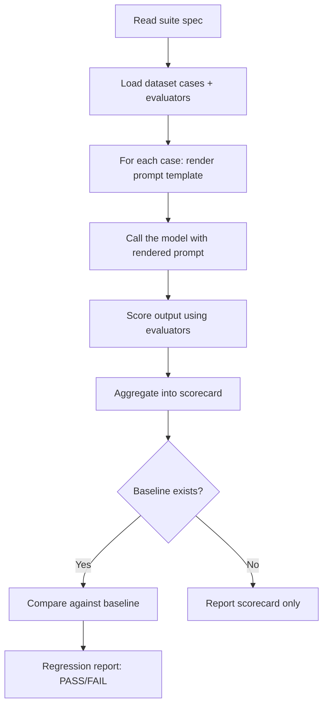

[](https://www.npmjs.com/package/apastra)
[](https://github.com/BintzGavin/apastra/actions/workflows/regression-gate.yml)
[](#license)

## Evaluate the prompts your agents depend on

Apastra is an eval framework for modern agent-driven engineering workflows.

Use it to test your agents' skills, review flows, planning flows, or any other AI instructions that affect how work gets done.

The goal is simple: keep your prompts in git, run them against repeatable test cases, score the outputs, and catch regressions in how they perform across different models and harnesses before bad instructions spread through your workflow.

If any instructions given to an AI are part of your development or production workflow, Apastra gives you a way to version, test, and baseline them like the rest of your code.

## What is an eval actually?

Evaluating AI prompts via deterministic tests instead of just guessing how they are working. Like unit tests for your prompts.

## What Is This?

Apastra is a file-based protocol and skill pack for evaluating your agent's skills and prompts. 


| If you want to...                         | Apastra gives you...                                               |
| ----------------------------------------- | ------------------------------------------------------------------ |
| Test prompt behavior repeatedly           | Datasets, evaluators, and suites stored in Git                     |
| Catch quality regressions before shipping | Baselines, scorecards, and regression reports                      |
| Stay local-first                          | Agent-driven workflows with optional GitHub Actions automation     |
| Keep things inspectable                   | Plain files, schema validation, and reviewable diffs               |
| Version prompts like code                 | YAML prompt specs with stable IDs, variables, and output contracts |


## Agent onboarding megaprompt

**Adopting Apastra in your own codebase** and want a single, copy-paste workflow for an AI assistant? Use `**[getting-started/megaprompt.md](getting-started/megaprompt.md)`**. It walks through install, choosing one first eval to prove the setup (`**apastra-writing-evals`** for design, `**apastra-scaffold**` for files), then optional baselines and CI—step by step, with pauses for decisions. That file is the **only** place the full prompt lives (this README just points to it).

## Is this actually lightweight?

Yes. It just sits in a folder and the agent calls it when needed. It uses some python scripts to run deterministic evals, but otherwise it's just yaml files. The only cost is when you run the evals, which is opt-in. So you can use it as much or as little as you want.

It has gotten more capable since it started (e.g. adding GitHub Actions support for automated regression testing). But the initial install and first eval are still very slim and you incrementally opt-in to everything else from there. You can also just ignore it and never use it and it will have no impact on you. Until you decide to opt into the GitHub actions CI at least.

## Documentation

- **[Onboarding megaprompt](getting-started/megaprompt.md)** — structured, agent-led setup when you are adding Apastra to **your** repository (not the quick steps below, which assume you are already in a project with Apastra installed).
- [Getting started](docs/guides/getting-started.md)
- [Architecture overview](docs/guides/architecture-overview.md)
- [API reference](docs/api)
- [System vision](docs/vision.md)

## Quick Start

**Installing Apastra into your repo with help from a coding agent?** Use `**[getting-started/megaprompt.md](getting-started/megaprompt.md)`**—see **Agent onboarding megaprompt** above. The numbered steps below are for day-to-day use **after** Apastra is already in your repo.

### 1. Install the skill pack

Two install paths — pick whichever fits your project.

**Option A — Git clone (language-agnostic, recommended):**

```bash
git clone --single-branch --depth 1 https://github.com/BintzGavin/apastra.git .agent/skills/apastra
.agent/skills/apastra/setup
```

**Option B — npm:**

```bash
npm install apastra
```

Either path installs to the same layout:

- `.agent/skills/apastra/` — SKILL.md instructions your agent loads
- `.agent/scripts/apastra/` — deterministic Python runtime + shell validators

The `setup` script auto-installs `pyyaml` and `jsonschema` (falls back to clear manual-install guidance on PEP-668 environments). npm's `postinstall.sh` does the same.

### 2. Scaffold your first prompt workflow

Ask your agent:

> "Use the apastra-scaffold skill to create a prompt spec, dataset, evaluator, and suite for summarizing text"

You will get a repo-native setup like:

```text
promptops/
├── prompts/summarize-v1.yaml
├── datasets/summarize-smoke.jsonl
├── evaluators/contains-keywords.yaml
└── suites/summarize-smoke.yaml
```

### 3. Run an eval

Ask your agent:

> "Use the apastra-eval skill to run the summarize-smoke suite"

The agent loads the suite, renders the prompt for each case, calls the model, scores the outputs, and reports a scorecard.

```text
Suite: summarize-smoke
Status: PASS

Metrics:
  keyword_recall: 0.85 (threshold: 0.60)
```

### 4. Save a baseline

Ask your agent:

> "Use the apastra-baseline skill to set the current results as the baseline"

Future evals can now detect regressions automatically when prompt quality drops below the accepted threshold.

That is enough to start using apastra locally. CI and release automation are available when you want them, but they are not required to get value from the repo.

> **Note for AI agents:** This README is the quickstart. For the full architectural model and design principles, start with `[docs/vision.md](docs/vision.md)`.

## Included Skills


| Skill                     | What it does                                                                                       |
| ------------------------- | -------------------------------------------------------------------------------------------------- |
| `apastra-getting-started` | Project setup and onboarding walkthrough                                                           |
| `apastra-writing-evals`   | Interactive eval design (paired workflow; link-disciplined reference to the Writing evals article) |
| `apastra-eval`            | Run evaluations from suites, score outputs, and compare baselines                                  |
| `apastra-baseline`        | Establish and manage known-good baselines                                                          |
| `apastra-scaffold`        | Generate prompt specs, datasets, evaluators, and suites                                            |
| `apastra-validate`        | Validate protocol files against JSON schemas                                                       |
| `apastra-red-team`        | Generate adversarial test cases                                                                    |
| `apastra-setup-ci`        | Install the GitHub Actions workflows for regression gating and release                             |


All skills install together — there is no per-skill install path. Once installed under `.agent/skills/apastra/`, your agent discovers each sub-skill by its `SKILL.md`.

## Core Concepts

### Prompt Spec

A YAML file defining a prompt with a stable ID, input variables, a template, and an optional output contract.

```yaml
id: summarize-v1
variables:
  text: { type: string }
template: "Summarize: {{text}}"
```

### Dataset

A `.jsonl` file of test cases — one JSON object per line with a `case_id` and `inputs`.

```jsonl
{"case_id": "case-1", "inputs": {"text": "..."}, "expected_outputs": {"should_contain": ["key", "words"]}}
```

### Evaluator

A scoring rule — deterministic checks, schema validation, or AI judge grading.

```yaml
id: keyword-check
type: deterministic
metrics: [keyword_recall]
```

### Inline Assertions (Quick Mode)

For simple checks, skip the evaluator file entirely — put assertions directly on your test cases:

```jsonl
{"case_id": "case-1", "inputs": {"text": "..."}, "assert": [{"type": "contains", "value": "summary"}, {"type": "is-json"}]}
```

Built-in assertion types: `equals`, `contains`, `icontains`, `contains-any`, `contains-all`, `regex`, `starts-with`, `is-json`, `contains-json`, `similar`, `llm-rubric`, `factuality`, `latency`, `cost`. Negate any with `not-` prefix (e.g. `not-contains`).

### Quick Eval (Single File)

For rapid iteration, combine prompt + cases + assertions into one file (`promptops/evals/my-eval.yaml`):

```yaml
id: summarize-quick
prompt: "Summarize in {{max_length}} words: {{text}}"
cases:
  - id: short
    inputs: { text: "The fox jumps over the dog.", max_length: "10" }
    assert:
      - type: icontains
        value: "fox"
thresholds:
  pass_rate: 1.0
```

Graduate to the full spec/dataset/evaluator/suite structure as complexity grows.

### Suite

A test configuration that ties everything together: which datasets, which evaluators, which models.

```yaml
id: smoke
name: Smoke Suite
datasets: [summarize-smoke]
evaluators: [keyword-check]
model_matrix: [default]
thresholds: { keyword_recall: 0.6 }
```

### Baseline & Regression

A baseline is a saved scorecard from a passing run. Future evals compare against it. If quality drops beyond allowed thresholds, it's a **regression**.

## File Structure

### In your project (after install)

```
.agent/
├── skills/apastra/       # Agent-facing SKILL.md files (eval, baseline, scaffold, …)
└── scripts/apastra/      # Deterministic runtime (Python + shell validators)
promptops/                # Created by the scaffold skill on first use
├── prompts/              # Prompt specs (YAML)
├── datasets/             # Test cases (JSONL)
├── evaluators/           # Scoring rules (YAML)
├── suites/               # Test configurations (YAML)
└── policies/             # Regression policies (allowed thresholds)
derived-index/
├── baselines/            # Known-good scorecards
└── regressions/          # Regression reports
```

### In this repo (what gets shipped)

`promptops/` here contains the runtime source that lands in your project's `.agent/scripts/apastra/` at install time — schemas, validators, resolver, runs, harnesses. You do not copy this directory into your project directly; `setup` / `postinstall.sh` does that.

## How the Agent Runs Evals

Your IDE agent **is** the harness. When you ask it to run an eval:




Deterministic steps (prompt rendering, digest computation, scorecard normalization, baseline comparison, schema validation) are delegated to Python + shell scripts under `.agent/scripts/apastra/`. Your agent handles the LLM-dependent parts: calling the model and grading with judge evaluators. No hosted service, no SaaS dependency — just files, scripts, and your agent.

---

## Scaling Up (Optional)

When you're ready for more structure, apastra supports:

### GitHub Actions CI

Apastra ships three tiers of workflows. Pick the tier that matches your governance needs.

**Basic CI (2 workflows)** — a minimal PR-gate + release pair for teams upgrading from local-first:


| Workflow             | Trigger                     | What it does                                                     |
| -------------------- | --------------------------- | ---------------------------------------------------------------- |
| `prompt-eval.yml`    | PRs touching `promptops/`** | Delegates to `regression-gate.yml` to block merges on regression |
| `prompt-release.yml` | Tag push                    | Delegates to `immutable-release.yml` to cut an immutable release |


**Full CI (6 workflows)** — fine-grained control for teams needing explicit promotion, delivery, and approval records:


| Workflow                | Trigger                  | What it does                                     |
| ----------------------- | ------------------------ | ------------------------------------------------ |
| `regression-gate.yml`   | Pull requests            | Blocks merge if regression is detected           |
| `auto-merge.yml`        | CI pass                  | Auto-merges PRs that pass all checks             |
| `promote.yml`           | Manual / release publish | Creates append-only promotion records            |
| `deliver.yml`           | After promotion          | Syncs approved versions to delivery targets      |
| `immutable-release.yml` | Tag push                 | Creates immutable GitHub releases                |
| `record-approval.yml`   | Manual                   | Appends a machine-readable approval state record |


**Canary + hygiene (3 workflows)** — post-ship drift detection and supply-chain basics:


| Workflow                     | Trigger                                                        | What it does                                                          |
| ---------------------------- | -------------------------------------------------------------- | --------------------------------------------------------------------- |
| `canary-drift-detection.yml` | Hourly cron + manual                                           | Runs canary suites against prod baselines; catches silent model drift |
| `schema-validation.yml`      | PRs touching `promptops/prompts/`** or `promptops/datasets/`** | Validates protocol files against JSON schemas                         |
| `secret-scan.yml`            | PRs touching `promptops/prompts/`** or `promptops/datasets/**` | Scans prompts and datasets for leaked secrets                         |


### Git-First Consumption

Apps can pin prompts by commit SHA, tag, or semver — npm and pip both support Git dependencies natively:

```yaml
# consumption.yaml
version: "1.0"
prompts:
  summarize-v1:
    pin: "abc123"  # commit SHA, tag, or semver
```

Resolution order: local override → workspace → git ref → packaged artifact.

### Governed Releases


| Packaging            | When to use                                  |
| -------------------- | -------------------------------------------- |
| Git ref (tag/SHA)    | Default — zero publishing overhead           |
| GitHub Release asset | Governed releases with optional immutability |
| OCI artifact         | Org-wide digest-addressed distribution       |


---

## Principles

- **Files in Git are the source of truth** — not a database, not a platform
- **Your agent is the harness** — no framework lock-in
- **Append-only artifacts** — never mutate old results; create new records
- **Reproducibility by default** — content digests, environment metadata
- **Local-first, CI-optional** — start with zero infrastructure

## Roadmap (beyond included skills)

Shipped skills are listed under **Included Skills** above (including `apastra-red-team`). Everything here is **extra surface area**: some pieces already exist in the runtime or as schemas, while the agent-facing skill or production hardening is still to come. For depth and evolving status, see [docs/vision.md](docs/vision.md) (expansion backlog).


| Capability                                                         | Status                          | Today / next                                                                                                                                                                                                                   |
| ------------------------------------------------------------------ | ------------------------------- | ------------------------------------------------------------------------------------------------------------------------------------------------------------------------------------------------------------------------------ |
| `**apastra-audit`** — scan for hardcoded prompts and "prompt debt" | Partial — runtime               | `promptops/runtime/audit.py`, CLI `audit`, `audit-shim.sh`. **Missing:** dedicated `apastra-audit` skill.                                                                                                                      |
| **Drift / canaries** — scheduled checks for post-ship model drift  | Partial — runtime + CI scaffold | `promptops/runtime/canary.py`, canary schemas and samples, drift report helpers, `canary-drift-detection.yml`. **Missing:** reliable alerting/rollback wiring in workflows.                                                    |
| `**apastra-compare`** — multi-model runs and comparison scorecards | Partial — runtime               | `promptops/runtime/compare.py`, CLI `compare`, comparison scorecard schema. **Missing:** polished UX and promotion-candidate flows.                                                                                            |
| `**apastra-review`** — strict prompt-spec review                   | Partial — CLI helper            | `apastra-review` entry point in `promptops/runtime/cli.py`. **Missing:** skill pack directory and guided agent workflow.                                                                                                       |
| `**apastra-optimize`** — token/cost-oriented prompt tightening     | Partial — CLI helper            | `apastra-optimize` entry point in `promptops/runtime/cli.py`. **Missing:** skill pack directory and guided agent workflow.                                                                                                     |
| **Community / starter packs**                                      | Partial — artifacts             | Starter pack JSON under `derived-index/starter-packs/` (summarization, extraction, classification, code review). **Missing:** curated installable repos and public registry story.                                             |
| **Observability adapters**                                         | Partial — schema + bridge       | Adapter schema, `promptops/delivery/observability.yaml`, `promptops/runtime/observability.py`, `promptops/runs/emit_observability.py` (Langfuse / OpenTelemetry shapes). **Missing:** production-grade emission to real sinks. |


## Planned Refinements

- **Simplified minimal mode** — auto-detected when few prompt specs exist; default layout trimmed to `prompts/`, `evals/`, and `baselines/` only
- **Project-level config** — **shipped at runtime:** upward-discovered `promptops.config.yaml` / `.yml` with schema and default application; documentation of precedence rules still improving
- **MCP integration** — **partial:** MCP server and tools in `promptops/runtime/mcp_server.py` (e.g. list suites, run evaluation); richer MCP definitions inside prompt specs and packaging remain roadmap
- **First-class cost tracking** — total cost in every run manifest, cost delta in regression reports, optional `cost_budget` on suites

## License

Apache-2.0
