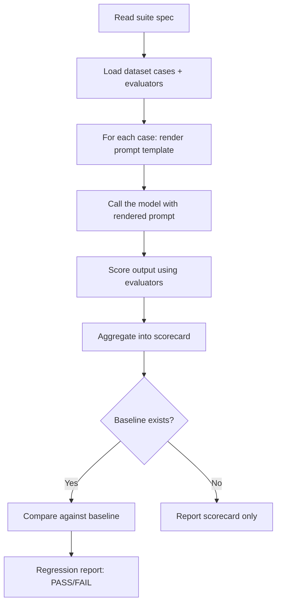

# apastra

Ship AI prompts with the same discipline as code. Version them, test them, catch regressions — all locally, using the agent in your IDE.

## Quick Start (5 minutes)

### 1. Install skills

```bash
npx skills add BintzGavin/apastra --all --full-depth -y
```

This adds apastra skills to your IDE agent (Claude Code, Cursor, Amp, Codex, and 37 more). Your agent now knows how to evaluate, baseline, scaffold, and validate prompts.

### 2. Scaffold your first prompt

Ask your agent:

> "Use the apastra-scaffold skill to create a prompt spec, dataset, evaluator, and suite for summarizing text"

Your agent will create:

```
promptops/
├── prompts/summarize-v1.yaml       # Prompt template + variables
├── datasets/summarize-smoke.jsonl   # Test cases (5 examples)
├── evaluators/contains-keywords.yaml # Scoring rule
└── suites/summarize-smoke.yaml      # Test configuration
```

### 3. Run your first eval

Ask your agent:

> "Use the apastra-eval skill to run the summarize-smoke suite"

Your agent reads the suite, runs each test case through the model, scores results, and reports:

```
Suite: summarize-smoke
Status: PASS ✅

Metrics:
  keyword_recall: 0.85 (threshold: 0.60) ✅
```

### 4. Set a baseline

> "Use the apastra-baseline skill to set the current results as the baseline"

Now future evals compare against this baseline. If you change the prompt and quality drops, the agent tells you.

That's it. No CI, no cloud, no API keys to configure. Your agent is the harness.

---

> **🤖 Note for AI Agents**: This README is a quickstart guide. For the full architectural vision and system design principles, read [`docs/vision.md`](docs/vision.md).

## What Is This?

Apastra is a **file-based protocol** for managing AI prompts as versioned software assets. Prompts, test cases, scoring rules, and quality baselines are all files in your repo.

| What you get | How it works |
|---|---|
| **Prompt versioning** | Prompt specs are YAML files with stable IDs, variable schemas, and output contracts |
| **Automated evals** | Your IDE agent runs test suites against your prompts and scores the results |
| **Regression detection** | Compare new results against known-good baselines to catch quality drops |
| **Schema validation** | 23 JSON schemas ensure all files are correctly formatted |
| **No infrastructure** | No CI, no cloud, no hosted platform — just files and your agent |

## Installed Skills

| Skill | What it does |
|---|---|
| `apastra-getting-started` | Project setup and onboarding walkthrough |
| `apastra-eval` | Run evaluations (agent loads suites, calls model, scores, compares baselines) |
| `apastra-baseline` | Establish and manage known-good baselines |
| `apastra-scaffold` | Generate new prompt specs, datasets, evaluators, suites |
| `apastra-validate` | Validate all files against JSON schemas |

Install individual skills:
```bash
npx skills add BintzGavin/apastra/skills/eval
npx skills add BintzGavin/apastra/skills/baseline
```

## Core Concepts

### Prompt Spec
A YAML file defining a prompt with a stable ID, input variables, a template, and an optional output contract.

```yaml
id: summarize-v1
variables:
  text: { type: string }
template: "Summarize: {{text}}"
```

### Dataset
A `.jsonl` file of test cases — one JSON object per line with a `case_id` and `inputs`.

```jsonl
{"case_id": "case-1", "inputs": {"text": "..."}, "expected_outputs": {"should_contain": ["key", "words"]}}
```

### Evaluator
A scoring rule — deterministic checks, schema validation, or AI judge grading.

```yaml
id: keyword-check
type: deterministic
metrics: [keyword_recall]
```

### Suite
A test configuration that ties everything together: which datasets, which evaluators, which models.

```yaml
id: smoke
name: Smoke Suite
datasets: [summarize-smoke]
evaluators: [keyword-check]
model_matrix: [default]
thresholds: { keyword_recall: 0.6 }
```

### Baseline & Regression
A baseline is a saved scorecard from a passing run. Future evals compare against it. If quality drops beyond allowed thresholds, it's a **regression**.

## File Structure

```
promptops/
├── prompts/          # Prompt specs (YAML)
├── datasets/         # Test cases (JSONL)
├── evaluators/       # Scoring rules (YAML)
├── suites/           # Test configurations (YAML)
├── schemas/          # 23 JSON schemas for all file types
├── validators/       # Shell scripts for schema validation
├── policies/         # Regression policies (allowed thresholds)
├── harnesses/        # Reference harness adapter (optional)
├── resolver/         # Prompt resolution chain (Python)
├── runtime/          # Digest computation, resolution runtime
├── runs/             # Run artifacts, scorecard normalizer, comparator
├── manifests/        # Consumption manifests
└── delivery/         # Delivery targets
derived-index/
├── baselines/        # Known-good scorecards
└── regressions/      # Regression reports
```

## How the Agent Runs Evals

Your IDE agent **is** the harness. When you ask it to run an eval:



No external runtime. No Python scripts to install. The agent reads the protocol files and executes the workflow.

---

## Scaling Up (Optional)

When you're ready for more structure, apastra supports:

### GitHub Actions CI

Five pre-built workflows gate merges and automate promotions:

| Workflow | Trigger | What it does |
|---|---|---|
| `regression-gate.yml` | Pull requests | Blocks merge if regression is detected |
| `promote.yml` | Manual or release publish | Creates append-only promotion records |
| `deliver.yml` | After promotion | Syncs approved versions to delivery targets |
| `immutable-release.yml` | Tag push | Creates immutable GitHub releases |
| `auto-merge.yml` | CI pass | Auto-merges PRs that pass all checks |

### Autonomous Agent Loops

For teams running autonomous coding agents, apastra includes a full agent system with 5 domain roles (CONTRACTS, RUNTIME, EVALUATION, GOVERNANCE, DOCS), each with planner/executor prompts and strict file ownership. See `.jules/prompts/` for the full agent prompt library. The architectural approach is described in [this blog post](https://agnt.one/blog/black-hole-architecture).

### Git-First Consumption

Apps can pin prompts by commit SHA, tag, or semver — npm and pip both support Git dependencies natively:

```yaml
# consumption.yaml
version: "1.0"
prompts:
  summarize-v1:
    pin: "abc123"  # commit SHA, tag, or semver
```

Resolution order: local override → workspace → git ref → packaged artifact.

### Governed Releases

| Packaging | When to use |
|---|---|
| Git ref (tag/SHA) | Default — zero publishing overhead |
| GitHub Release asset | Governed releases with optional immutability |
| OCI artifact | Org-wide digest-addressed distribution |

---

## Principles

- **Files in Git are the source of truth** — not a database, not a platform
- **Your agent is the harness** — no framework lock-in
- **Append-only artifacts** — never mutate old results; create new records
- **Reproducibility by default** — content digests, environment metadata
- **Local-first, CI-optional** — start with zero infrastructure

## License

Apache-2.0
