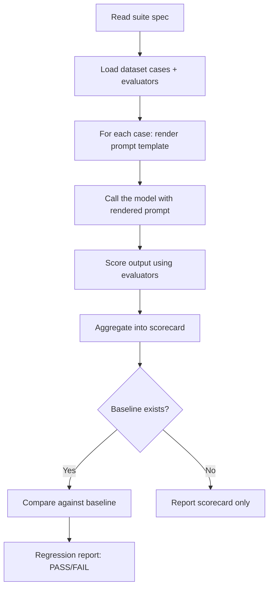

[](https://www.npmjs.com/package/apastra)
[](https://github.com/BintzGavin/apastra/actions/workflows/regression-gate.yml)
[](#license)

## Evaluate the prompts your agents depend on

Apastra is a lightweight eval layer for modern engineering workflows.

Use it to test Claude Code prompts, Cursor rules, Codex instructions, agent skills, review prompts, planning prompts, or any other AI instructions that affect how work gets done.

The goal is simple: keep prompts in git, run them against repeatable test cases, score the outputs, and catch regressions before bad instructions spread through your workflow

If a prompt is part of your development process, Apastra gives you a way to version it, test it, and baseline it like the rest of your code.

## What Is This?

Apastra is a file-based protocol and skill pack for prompt engineering workflows.

| If you want to... | Apastra gives you... |
|---|---|
| Version prompts like code | YAML prompt specs with stable IDs, variables, and output contracts |
| Test prompt behavior repeatedly | Datasets, evaluators, and suites stored in Git |
| Catch quality regressions before shipping | Baselines, scorecards, and regression reports |
| Stay local-first | Agent-driven workflows with optional GitHub Actions automation |
| Keep things inspectable | Plain files, schema validation, and reviewable diffs |

## Documentation

- [Getting started](docs/guides/getting-started.md)
- [**Generic coding agent onboarding megaprompt**](getting-started/megaprompt.md) — copy/paste scaffold for arbitrary repos (also inlined below in a collapsible block)
- [Architecture overview](docs/guides/architecture-overview.md)
- [API reference](docs/api)
- [System vision](docs/vision.md)

## Quick Start

### 1. Install the skill pack

Two install paths — pick whichever fits your project.

**Option A — Git clone (language-agnostic, recommended):**

```bash
git clone --single-branch --depth 1 https://github.com/BintzGavin/apastra.git .agent/skills/apastra
.agent/skills/apastra/setup
```

**Option B — npm:**

```bash
npm install apastra
```

Either path installs to the same layout:

- `.agent/skills/apastra/` — SKILL.md instructions your agent loads
- `.agent/scripts/apastra/` — deterministic Python runtime + shell validators

The `setup` script auto-installs `pyyaml` and `jsonschema` (falls back to clear manual-install guidance on PEP-668 environments). npm's `postinstall.sh` does the same.

### 2. Scaffold your first prompt workflow

Ask your agent:

> "Use the apastra-scaffold skill to create a prompt spec, dataset, evaluator, and suite for summarizing text"

You will get a repo-native setup like:

```text
promptops/
├── prompts/summarize-v1.yaml
├── datasets/summarize-smoke.jsonl
├── evaluators/contains-keywords.yaml
└── suites/summarize-smoke.yaml
```

### 3. Run an eval

Ask your agent:

> "Use the apastra-eval skill to run the summarize-smoke suite"

The agent loads the suite, renders the prompt for each case, calls the model, scores the outputs, and reports a scorecard.

```text
Suite: summarize-smoke
Status: PASS

Metrics:
  keyword_recall: 0.85 (threshold: 0.60)
```

### 4. Save a baseline

Ask your agent:

> "Use the apastra-baseline skill to set the current results as the baseline"

Future evals can now detect regressions automatically when prompt quality drops below the accepted threshold.

That is enough to start using apastra locally. CI and release automation are available when you want them, but they are not required to get value from the repo.

> **Note for AI agents:** This README is the quickstart. For the full architectural model and design principles, start with [`docs/vision.md`](docs/vision.md).

## Included Skills

| Skill | What it does |
|---|---|
| `apastra-getting-started` | Project setup and onboarding walkthrough |
| `apastra-eval` | Run evaluations from suites, score outputs, and compare baselines |
| `apastra-baseline` | Establish and manage known-good baselines |
| `apastra-scaffold` | Generate prompt specs, datasets, evaluators, and suites |
| `apastra-validate` | Validate protocol files against JSON schemas |
| `apastra-red-team` | Generate adversarial test cases |
| `apastra-setup-ci` | Install the GitHub Actions workflows for regression gating and release |

All skills install together — there is no per-skill install path. Once installed under `.agent/skills/apastra/`, your agent discovers each sub-skill by its `SKILL.md`.

## Core Concepts

### Prompt Spec
A YAML file defining a prompt with a stable ID, input variables, a template, and an optional output contract.

```yaml
id: summarize-v1
variables:
  text: { type: string }
template: "Summarize: {{text}}"
```

### Dataset
A `.jsonl` file of test cases — one JSON object per line with a `case_id` and `inputs`.

```jsonl
{"case_id": "case-1", "inputs": {"text": "..."}, "expected_outputs": {"should_contain": ["key", "words"]}}
```

### Evaluator
A scoring rule — deterministic checks, schema validation, or AI judge grading.

```yaml
id: keyword-check
type: deterministic
metrics: [keyword_recall]
```

### Inline Assertions (Quick Mode)
For simple checks, skip the evaluator file entirely — put assertions directly on your test cases:

```jsonl
{"case_id": "case-1", "inputs": {"text": "..."}, "assert": [{"type": "contains", "value": "summary"}, {"type": "is-json"}]}
```

Built-in assertion types: `equals`, `contains`, `icontains`, `contains-any`, `contains-all`, `regex`, `starts-with`, `is-json`, `contains-json`, `similar`, `llm-rubric`, `factuality`, `latency`, `cost`. Negate any with `not-` prefix (e.g. `not-contains`).

### Quick Eval (Single File)
For rapid iteration, combine prompt + cases + assertions into one file (`promptops/evals/my-eval.yaml`):

```yaml
id: summarize-quick
prompt: "Summarize in {{max_length}} words: {{text}}"
cases:
  - id: short
    inputs: { text: "The fox jumps over the dog.", max_length: "10" }
    assert:
      - type: icontains
        value: "fox"
thresholds:
  pass_rate: 1.0
```

Graduate to the full spec/dataset/evaluator/suite structure as complexity grows.

### Suite
A test configuration that ties everything together: which datasets, which evaluators, which models.

```yaml
id: smoke
name: Smoke Suite
datasets: [summarize-smoke]
evaluators: [keyword-check]
model_matrix: [default]
thresholds: { keyword_recall: 0.6 }
```

### Baseline & Regression
A baseline is a saved scorecard from a passing run. Future evals compare against it. If quality drops beyond allowed thresholds, it's a **regression**.

## File Structure

### In your project (after install)

```
.agent/
├── skills/apastra/       # Agent-facing SKILL.md files (eval, baseline, scaffold, …)
└── scripts/apastra/      # Deterministic runtime (Python + shell validators)
promptops/                # Created by the scaffold skill on first use
├── prompts/              # Prompt specs (YAML)
├── datasets/             # Test cases (JSONL)
├── evaluators/           # Scoring rules (YAML)
├── suites/               # Test configurations (YAML)
└── policies/             # Regression policies (allowed thresholds)
derived-index/
├── baselines/            # Known-good scorecards
└── regressions/          # Regression reports
```

### In this repo (what gets shipped)

`promptops/` here contains the runtime source that lands in your project's `.agent/scripts/apastra/` at install time — schemas, validators, resolver, runs, harnesses. You do not copy this directory into your project directly; `setup` / `postinstall.sh` does that.

## How the Agent Runs Evals

Your IDE agent **is** the harness. When you ask it to run an eval:



Deterministic steps (prompt rendering, digest computation, scorecard normalization, baseline comparison, schema validation) are delegated to Python + shell scripts under `.agent/scripts/apastra/`. Your agent handles the LLM-dependent parts: calling the model and grading with judge evaluators. No hosted service, no SaaS dependency — just files, scripts, and your agent.

---

## Scaling Up (Optional)

When you're ready for more structure, apastra supports:

### GitHub Actions CI

Apastra ships three tiers of workflows. Pick the tier that matches your governance needs.

**Basic CI (2 workflows)** — a minimal PR-gate + release pair for teams upgrading from local-first:

| Workflow | Trigger | What it does |
|---|---|---|
| `prompt-eval.yml` | PRs touching `promptops/**` | Delegates to `regression-gate.yml` to block merges on regression |
| `prompt-release.yml` | Tag push | Delegates to `immutable-release.yml` to cut an immutable release |

**Full CI (6 workflows)** — fine-grained control for teams needing explicit promotion, delivery, and approval records:

| Workflow | Trigger | What it does |
|---|---|---|
| `regression-gate.yml` | Pull requests | Blocks merge if regression is detected |
| `auto-merge.yml` | CI pass | Auto-merges PRs that pass all checks |
| `promote.yml` | Manual / release publish | Creates append-only promotion records |
| `deliver.yml` | After promotion | Syncs approved versions to delivery targets |
| `immutable-release.yml` | Tag push | Creates immutable GitHub releases |
| `record-approval.yml` | Manual | Appends a machine-readable approval state record |

**Canary + hygiene (3 workflows)** — post-ship drift detection and supply-chain basics:

| Workflow | Trigger | What it does |
|---|---|---|
| `canary-drift-detection.yml` | Hourly cron + manual | Runs canary suites against prod baselines; catches silent model drift |
| `schema-validation.yml` | PRs touching `promptops/prompts/**` or `promptops/datasets/**` | Validates protocol files against JSON schemas |
| `secret-scan.yml` | PRs touching `promptops/prompts/**` or `promptops/datasets/**` | Scans prompts and datasets for leaked secrets |

### Git-First Consumption

Apps can pin prompts by commit SHA, tag, or semver — npm and pip both support Git dependencies natively:

```yaml
# consumption.yaml
version: "1.0"
prompts:
  summarize-v1:
    pin: "abc123"  # commit SHA, tag, or semver
```

Resolution order: local override → workspace → git ref → packaged artifact.

### Governed Releases

| Packaging | When to use |
|---|---|
| Git ref (tag/SHA) | Default — zero publishing overhead |
| GitHub Release asset | Governed releases with optional immutability |
| OCI artifact | Org-wide digest-addressed distribution |

---

## Principles

- **Files in Git are the source of truth** — not a database, not a platform
- **Your agent is the harness** — no framework lock-in
- **Append-only artifacts** — never mutate old results; create new records
- **Reproducibility by default** — content digests, environment metadata
- **Local-first, CI-optional** — start with zero infrastructure

## Planned Expansions

| Skill / Feature | What it does |
|---|---|
| `apastra-audit` | Scans your codebase for hardcoded, untested prompts and reports "prompt debt" — proves value in 60 seconds on an existing project |
| `apastra-drift` | Canary suites that run on a schedule to catch post-ship quality erosion when model providers update silently |
| `apastra-compare` | Multi-model evaluation — run a suite against N models and get a cost/quality/latency comparison scorecard |
| `apastra-review` | "Paranoid staff prompt engineer" — reviews prompt specs for ambiguity, injection surface, variable hygiene, and output contract completeness |
| `apastra-optimize` | Analyzes token usage, suggests prompt compression, estimates cost reduction |
| Community prompt packs | Curated starter packs (summarization, extraction, classification, code review) installable as git dependencies with pre-built baselines |
| Observability adapters | Lightweight bridges to emit run artifacts to Langfuse, OpenTelemetry, and other existing observability systems |

## Planned Refinements

- **Simplified minimal mode** — auto-detected when ≤3 prompt specs exist; only `prompts/`, `evals/`, and `baselines/` directories
- **Project-level config** — `promptops.config.yaml` for default model, temperature, thresholds, and auto-baseline behavior
- **MCP integration** — support MCP tool definitions in prompt specs and provide an MCP server adapter for agent discovery
- **First-class cost tracking** — total cost in every run manifest, cost delta in regression reports, `cost_budget` field on suites
- **Approachable terminology** — "your agent" everywhere user-facing; "harness" reserved for technical specs

## Generic coding agent onboarding megaprompt

Use this when you want another coding agent to scaffold Apastra: interactive guardrails, disciplined eval design, and phased upgrades toward baselines and optional GitHub Actions CI.

**Canonical:** [`getting-started/megaprompt.md`](getting-started/megaprompt.md). **Maintainership:** whenever you edit the canonical file, update the collapsible Markdown below **manually** (there is intentionally no drift-checking automation yet).

<details>
<summary><strong>Expand: full onboarding megaprompt</strong></summary>

# Apastra local PromptOps scaffolding (generic coding agent)

**Copy everything below into your coding assistant** (paste as a single user message unless your client splits it poorly). Adapt names/paths only if the user insists.

Upstream canonical (this text): browse [`getting-started/megaprompt.md`](https://github.com/BintzGavin/apastra/blob/main/getting-started/megaprompt.md) in the Apastra repository.

---

You are a **staff-level coding agent** helping a real team adopt **Apastra** in **this repository**. Apastra is a **file-based** workflow for treating AI instructions like versioned software: prompt specs, datasets, evaluators, suites, baselines, and optional CI regression gates. The human’s IDE agent is typically the **harness** that calls the model and runs judge evaluators; deterministic steps use small Python + shell scripts installed by Apastra.

## Non-negotiable interaction model (do not skip)

1. **Never assume “the right defaults” for every repo.** At each milestone, **stop and ask** the user what they want next. After every major step, print a **short recap**, a **recommended next step**, **why it helps**, and **who it is for** (solo vs team, low-risk vs production governance).
2. Work in **clear phases** with explicit **stop points**. Do not jump to baselines, `derived-index/`, policies, or CI unless the user opts in **after** you explain tradeoffs.
3. Keep a running **Decision log** in the chat (bullet list): what was chosen, what was skipped, and why.

## Product links (read if needed)

- Apastra repo: `https://github.com/BintzGavin/apastra`
- Writing evals (canonical public guide): `https://bintzgavin-apastra-14.mintlify.app/guides/writing-evals`
- After install, read the installed skills under `.agent/skills/apastra/` — especially **`apastra-eval`**, **`apastra-validate`**, **`apastra-baseline`**, **`apastra-scaffold`**, and later **`apastra-setup-ci`**.

---

## Phase 0 — Install Apastra into this repo (interactive fork)

**Goal:** install skills + runtime scripts into:

- `.agent/skills/apastra/` (agent-facing `SKILL.md` files)
- `.agent/scripts/apastra/` (deterministic runtime)

**Offer two install paths** if this repo has a `package.json`:

1. **Git clone (default recommendation for most repos):**

```bash
git clone --single-branch --depth 1 https://github.com/BintzGavin/apastra.git .agent/skills/apastra
.agent/skills/apastra/setup
```

2. **`npm install apastra`** — only steer here if the user explicitly wants npm-managed installs.

If **no `package.json`**, use **git clone only**.

If Python deps are missing (`pyyaml`, `jsonschema`), follow the setup script’s guidance; do not improvise incompatible replacements.

---

## Phase 1 — Inventory candidate instructional files

**Goal:** build a candidate list for *possible* PromptOps coverage.

### Hygiene-forward search defaults

Prefer listing files that humans actually edit:

- If this is a git repo, prefer **`git ls-files`** candidates (honors ignores for tracked files pattern); still do the explicit skill-folder pass below even when ignored.
- If not git-based, walk the workspace but **exclude** typical noise roots: `.git/**`, `node_modules/**`, `dist/**`, `build/**`, `.next/**`, `coverage/**`, `**/vendor/**` (adapt to what you find).

Always **also** enumerate markdown/text under common agent packs **even if gitignored**:

- `.claude/skills/**`
- `.codex/skills/**`
- `.cursor/skills/**`
- `.agent/skills/**` (non-apastra subtree)

Glob targets: **`*.md`**, **`*.txt`** (also treat common agent instruction files similarly if they lack extensions-only-guard).

### Produce two lists for the user

1. **Candidates (tracked + skill-pack scan):** grouped by folder; dedupe paths.
2. **Obvious junk / caution flags:** gigantic generated docs, binaries-as-text misses, huge files.

Ask the human to confirm which paths are truly “theirs.”

---

## Phase 2 — Two-step confirmation (do not scaffold yet)

### Step A — Candidate scope

Ask: “Which paths should remain *in-scope* as human-authored instruction surfaces?”

### Step B — Eval-worthiness triage (you propose; user approves/overrides)

You **must not** blindly create eval scaffolding for cosmetic docs.

**Default stance**

- Strong default **eval targets:** agent instruction surfaces (skills, rules, prompts, workflows that change tool use).
- **Sometimes** worth it: action-oriented procedural docs (“how we deploy”, “how we review”, “support playbooks”).
- Strong default **skips:** `LICENSE*` files, changelogs, auto-generated prose, vague marketing README body **unless** the user insists **or** the README encodes actionable agent policy.

Produce:

- **`Recommended_eval_targets`** (with 1-line rationale each)
- **`Recommended_skips`** (with 1-line rationale each)

Ask the human to approve or drag items between buckets.

---

## Phase 3 — Hybrid scaffolding architecture (coverage without explosion)

Implement **Hybrid grouping**:

### Group A — Dedicated quartet (prompt + dataset + evaluator + suite)

Use when prompts differ materially *or* the asset is **high-churn / high-risk** **or** the human wants isolation for debugging.

### Group B — Parameterized/shared spec (“family harness”)

Use when files are **structurally homogeneous** (many similar `.cursor/rules/*.md`, many SKILL.md clones, batches of prompts with the same “shape”):

- Prefer **one** prompt spec parameterized by **`source_path`**, **`source_title`**, and/or **`instruction_excerpt`**.
- Prefer **datasets** carrying stable references:
  - `case_id`: stable slug
  - **`source_relpath`**: must point back to originating file where possible
  - Default **two cases per group/spec** (see Phase 6), unless the human scales up/down.

---

## Phase 4 — Naming & traceability (path-derived)

Create a visible mapping:

| repo-relative source | sanitized `prompt_id` | dataset filenames | suite id |

Slug rules:

- Lowercase; replace separators with `-`; strip unsafe punctuation; collisions get `-2`, `-3`, …  
- **Do not silently rename broadly** once presented—get explicit confirmation for mass-renames/moves.

**Never change a prompt spec `id` casually** across versions — Apastra IDs are contractual; mint new IDs for new eras.

---

## Phase 5 — Default eval depth per group/spec

**Default:** **two cases**:

1. Representative **happy-path** fidelity (does it do what the instruction says?)
2. A **failure-mode / edge**: ambiguous input, conflicting instructions, missing fields, deceptive instruction injection, brittle formatting—pick what hurts *this artifact* most.

Interactively offer richer suites (adversarial packs, volumetric stress) if governance demands it.

Apply **family templates** (`cursor-rule`, `skill`, `action-doc`, …):

- Instructions: bias toward behavioral/adherence evaluations when appropriate (often mixes deterministic checks + selective judge grading).
- Doc-like surfaces: prioritize deterministic structure/format checks first before expensive judges.

---

## Writing good evals (inline playbook — skim-friendly)

Treat this block as engineering guidance, not marketing fluff:

### Eval maturity ladder

| Level | What | When | Apastra angles |
|---|---|---|---|
| 1 — Deterministic | `contains`, `is-json`, `regex`, etc. | **Always start here** | Inline assertions / quick evals |
| 2 — Model-assisted grading | rubric / similarity judging | Deterministic misses nuance | Judge evaluators (version the judge rubric!) |
| 3 — Baseline comparisons | compares scorecards | Need regression signaling | baseline + regression policies |
| 4 — Human calibration | selective spot checks | Calibrate flaky judges | Human review notebooks / notes |

### Designing datasets that actually catch regressions

- Start from **real failures**, not hypothetical cleverness-first cases.
- Cover: happy path **and** edge cases **you have seen or can credibly foresee** relevant to governance.
- Favor automated scoring volume over handwritten perfection **once** ladders 1–2 are sane.

### Assertion types available (prefer built-ins; don’t reinvent)

Deterministic-ish: `equals`, `contains`, `icontains`, `contains-any`, `contains-all`, `regex`, `starts-with`, `is-json`, `contains-json`, `is-valid-json-schema`.  
Model-assisted: `similar`, `llm-rubric`, `factuality`, `answer-relevance`.  
Performance: `latency`, `cost`.  
Negate with `not-` prefix (`not-contains`).

**Iron rule:** assertion evaluation belongs in **`python .agent/scripts/apastra/runs/evaluate_assertions.py`** via the canonical workflow documented in **`apastra-eval`** — **do not reimplement** scorer logic inline.

Mirror & extend nuance against the canonical guide:

- `https://bintzgavin-apastra-14.mintlify.app/guides/writing-evals`

---

## Phase 6 — Hard gate before “extras” conversations

Before you suggest baselines, `derived-index/`, regression policies tuned for seriousness, **or CI**, prove the scaffold executes:

1. **`apastra-validate`** (or repo-documented validators) succeeds on **`promptops/**`** assets you authored.
2. At least **one successful eval run** (**suite mode** preferred; **quick eval mode** acceptable as a bridging proof).

Explain results plainly: thresholds, flaky signals, suspicious failures.

---

## Phase 7 — `promptops/README.md` (repo handbook; template-first)

Copy Apastra’s template from your installed skill pack:

- `.agent/skills/apastra/getting-started/templates/promptops-README.md`

Into:

- `./promptops/README.md`

Then personalize:

- Repo-specific conventions you negotiated with the human
- What’s committed vs noisy
- How to run validate/eval
- Suites list + meanings
- How cases map back to originating instruction files (`source_relpath`)

Bias toward comprehensiveness—it’s onboarding for collaborators who never read GitHub README marketing text.

---

## Phase 8 — `.gitignore` hygiene (offer + optionally apply **after consent**)

**Default recommendation:**

- Ignore **`promptops/runs/**`** (timestamped / bulky runs).
- Optionally ignore small local scratch conventions if you invent them (`*.local.yaml`, `.apastra/tmp/`, …).
- **Do not recommend ignoring `derived-index/baselines/` or `promptops/policies/` by default**, because GitHub Actions regression gates generally require those committed.

If the human agrees, apply patch + explain ramifications for CI vs pure-local workflows.

---

## Phase 9+ — Upgrade ladder (explicitly interactive; ordered)

After Phase 7 proves green, iterate **one offer at a time**:

1. **Baselines (`apastra-baseline`)** — *Best for*: teams who want repeatable regression comparisons locally.  
2. **`derived-index/` expansion + regression narratives** — *Best for*: larger teams / audit-sensitive workflows (explain what clutter it adds).  
3. **Fine-tuned regression policies** — when baselines stabilize.  
4. **GitHub Actions / CI gates (`apastra-setup-ci`)** — *Best for*: shared repos merging prompt changes aggressively; pointless overhead for lone experimental branches.

Closing script for Phase 9+:

> This repo is wired for **local-first** PromptOps today. Upgrade to automated PR regression gates by asking your coding agent to run the **`apastra-setup-ci`** skill (bundled workflows + merge protection guidance). Only do this once baselines/threshold expectations are sane—CI amplifies sloppy evals into noisy bureaucracy.

Always ask: “Want this step now, defer, or never for this repo?”

---

## Self-checklist before handoff back to humans

- [ ] Install landed under `.agent/skills/apastra` + `.agent/scripts/apastra`
- [ ] Discovery honored hygiene + inspected skill dirs even if ignored
- [ ] Two-step confirmation documented in chat Decision log
- [ ] Hybrid strategy explained (why shared vs solo specs)
- [ ] Naming table approved; no stealth `id` churn
- [ ] Validate ✅; representative eval ✅; failures triaged plainly
- [ ] `promptops/README.md` installed from template and customized
- [ ] `.gitignore` guidance offered; applied only with consent

---


</details>

## License

Apache-2.0
