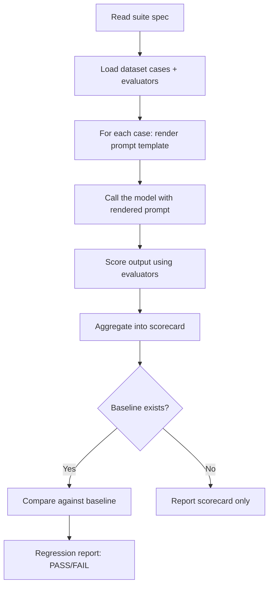

[](https://www.npmjs.com/package/apastra)
[](https://github.com/BintzGavin/apastra/stargazers)
[](https://github.com/BintzGavin/apastra/actions/workflows/regression-gate.yml)
[](#license)
> **Disclaimer**: apastra is in active development and not ready for production use yet.


Git-native prompt operations for teams that want to treat prompts like software assets.

Apastra keeps prompt specs, datasets, evaluators, suites, and baselines as plain files in your repo. Your coding agent reads those files to scaffold changes, run evals, compare against baselines, and validate contracts without requiring a hosted platform.

## What Is This?

Apastra is a file-based protocol and skill pack for prompt engineering workflows.

| If you want to... | Apastra gives you... |
|---|---|
| Version prompts like code | YAML prompt specs with stable IDs, variables, and output contracts |
| Test prompt behavior repeatedly | Datasets, evaluators, and suites stored in Git |
| Catch quality regressions before shipping | Baselines, scorecards, and regression reports |
| Stay local-first | Agent-driven workflows with optional GitHub Actions automation |
| Keep things inspectable | Plain files, schema validation, and reviewable diffs |

## Documentation

- [Getting started](docs/guides/getting-started.md)
- [Architecture overview](docs/guides/architecture-overview.md)
- [API reference](docs/api)
- [System vision](docs/vision.md)

## Quick Start

### 1. Install the skill pack

Two install paths — pick whichever fits your project.

**Option A — Git clone (language-agnostic, recommended):**

```bash
git clone --single-branch --depth 1 https://github.com/BintzGavin/apastra.git .agent/skills/apastra
.agent/skills/apastra/setup
```

**Option B — npm:**

```bash
npm install apastra
```

Either path installs to the same layout:

- `.agent/skills/apastra/` — SKILL.md instructions your agent loads
- `.agent/scripts/apastra/` — deterministic Python runtime + shell validators

The `setup` script auto-installs `pyyaml` and `jsonschema` (falls back to clear manual-install guidance on PEP-668 environments). npm's `postinstall.sh` does the same.

### 2. Scaffold your first prompt workflow

Ask your agent:

> "Use the apastra-scaffold skill to create a prompt spec, dataset, evaluator, and suite for summarizing text"

You will get a repo-native setup like:

```text
promptops/
├── prompts/summarize-v1.yaml
├── datasets/summarize-smoke.jsonl
├── evaluators/contains-keywords.yaml
└── suites/summarize-smoke.yaml
```

### 3. Run an eval

Ask your agent:

> "Use the apastra-eval skill to run the summarize-smoke suite"

The agent loads the suite, renders the prompt for each case, calls the model, scores the outputs, and reports a scorecard.

```text
Suite: summarize-smoke
Status: PASS

Metrics:
  keyword_recall: 0.85 (threshold: 0.60)
```

### 4. Save a baseline

Ask your agent:

> "Use the apastra-baseline skill to set the current results as the baseline"

Future evals can now detect regressions automatically when prompt quality drops below the accepted threshold.

That is enough to start using apastra locally. CI and release automation are available when you want them, but they are not required to get value from the repo.

> **Note for AI agents:** This README is the quickstart. For the full architectural model and design principles, start with [`docs/vision.md`](docs/vision.md).

## Included Skills

| Skill | What it does |
|---|---|
| `apastra-getting-started` | Project setup and onboarding walkthrough |
| `apastra-eval` | Run evaluations from suites, score outputs, and compare baselines |
| `apastra-baseline` | Establish and manage known-good baselines |
| `apastra-scaffold` | Generate prompt specs, datasets, evaluators, and suites |
| `apastra-validate` | Validate protocol files against JSON schemas |
| `apastra-red-team` | Generate adversarial test cases |
| `apastra-setup-ci` | Install the GitHub Actions workflows for regression gating and release |

All skills install together — there is no per-skill install path. Once installed under `.agent/skills/apastra/`, your agent discovers each sub-skill by its `SKILL.md`.

## Core Concepts

### Prompt Spec
A YAML file defining a prompt with a stable ID, input variables, a template, and an optional output contract.

```yaml
id: summarize-v1
variables:
  text: { type: string }
template: "Summarize: {{text}}"
```

### Dataset
A `.jsonl` file of test cases — one JSON object per line with a `case_id` and `inputs`.

```jsonl
{"case_id": "case-1", "inputs": {"text": "..."}, "expected_outputs": {"should_contain": ["key", "words"]}}
```

### Evaluator
A scoring rule — deterministic checks, schema validation, or AI judge grading.

```yaml
id: keyword-check
type: deterministic
metrics: [keyword_recall]
```

### Inline Assertions (Quick Mode)
For simple checks, skip the evaluator file entirely — put assertions directly on your test cases:

```jsonl
{"case_id": "case-1", "inputs": {"text": "..."}, "assert": [{"type": "contains", "value": "summary"}, {"type": "is-json"}]}
```

Built-in assertion types: `equals`, `contains`, `icontains`, `contains-any`, `contains-all`, `regex`, `starts-with`, `is-json`, `contains-json`, `similar`, `llm-rubric`, `factuality`, `latency`, `cost`. Negate any with `not-` prefix (e.g. `not-contains`).

### Quick Eval (Single File)
For rapid iteration, combine prompt + cases + assertions into one file (`promptops/evals/my-eval.yaml`):

```yaml
id: summarize-quick
prompt: "Summarize in {{max_length}} words: {{text}}"
cases:
  - id: short
    inputs: { text: "The fox jumps over the dog.", max_length: "10" }
    assert:
      - type: icontains
        value: "fox"
thresholds:
  pass_rate: 1.0
```

Graduate to the full spec/dataset/evaluator/suite structure as complexity grows.

### Suite
A test configuration that ties everything together: which datasets, which evaluators, which models.

```yaml
id: smoke
name: Smoke Suite
datasets: [summarize-smoke]
evaluators: [keyword-check]
model_matrix: [default]
thresholds: { keyword_recall: 0.6 }
```

### Baseline & Regression
A baseline is a saved scorecard from a passing run. Future evals compare against it. If quality drops beyond allowed thresholds, it's a **regression**.

## File Structure

### In your project (after install)

```
.agent/
├── skills/apastra/       # Agent-facing SKILL.md files (eval, baseline, scaffold, …)
└── scripts/apastra/      # Deterministic runtime (Python + shell validators)
promptops/                # Created by the scaffold skill on first use
├── prompts/              # Prompt specs (YAML)
├── datasets/             # Test cases (JSONL)
├── evaluators/           # Scoring rules (YAML)
├── suites/               # Test configurations (YAML)
└── policies/             # Regression policies (allowed thresholds)
derived-index/
├── baselines/            # Known-good scorecards
└── regressions/          # Regression reports
```

### In this repo (what gets shipped)

`promptops/` here contains the runtime source that lands in your project's `.agent/scripts/apastra/` at install time — schemas, validators, resolver, runs, harnesses. You do not copy this directory into your project directly; `setup` / `postinstall.sh` does that.

## How the Agent Runs Evals

Your IDE agent **is** the harness. When you ask it to run an eval:



Deterministic steps (prompt rendering, digest computation, scorecard normalization, baseline comparison, schema validation) are delegated to Python + shell scripts under `.agent/scripts/apastra/`. Your agent handles the LLM-dependent parts: calling the model and grading with judge evaluators. No hosted service, no SaaS dependency — just files, scripts, and your agent.

---

## Scaling Up (Optional)

When you're ready for more structure, apastra supports:

### GitHub Actions CI

Five pre-built workflows gate merges and automate promotions:

| Workflow | Trigger | What it does |
|---|---|---|
| `regression-gate.yml` | Pull requests | Blocks merge if regression is detected |
| `promote.yml` | Manual or release publish | Creates append-only promotion records |
| `deliver.yml` | After promotion | Syncs approved versions to delivery targets |
| `immutable-release.yml` | Tag push | Creates immutable GitHub releases |
| `auto-merge.yml` | CI pass | Auto-merges PRs that pass all checks |

### Git-First Consumption

Apps can pin prompts by commit SHA, tag, or semver — npm and pip both support Git dependencies natively:

```yaml
# consumption.yaml
version: "1.0"
prompts:
  summarize-v1:
    pin: "abc123"  # commit SHA, tag, or semver
```

Resolution order: local override → workspace → git ref → packaged artifact.

### Governed Releases

| Packaging | When to use |
|---|---|
| Git ref (tag/SHA) | Default — zero publishing overhead |
| GitHub Release asset | Governed releases with optional immutability |
| OCI artifact | Org-wide digest-addressed distribution |

---

## Principles

- **Files in Git are the source of truth** — not a database, not a platform
- **Your agent is the harness** — no framework lock-in
- **Append-only artifacts** — never mutate old results; create new records
- **Reproducibility by default** — content digests, environment metadata
- **Local-first, CI-optional** — start with zero infrastructure

## Planned Expansions

| Skill / Feature | What it does |
|---|---|
| `apastra-audit` | Scans your codebase for hardcoded, untested prompts and reports "prompt debt" — proves value in 60 seconds on an existing project |
| `apastra-drift` | Canary suites that run on a schedule to catch post-ship quality erosion when model providers update silently |
| `apastra-compare` | Multi-model evaluation — run a suite against N models and get a cost/quality/latency comparison scorecard |
| `apastra-review` | "Paranoid staff prompt engineer" — reviews prompt specs for ambiguity, injection surface, variable hygiene, and output contract completeness |
| `apastra-red-team` | Generates adversarial test cases: prompt injection attempts, edge-case inputs, multilingual stress tests |
| `apastra-optimize` | Analyzes token usage, suggests prompt compression, estimates cost reduction |
| Community prompt packs | Curated starter packs (summarization, extraction, classification, code review) installable as git dependencies with pre-built baselines |
| Observability adapters | Lightweight bridges to emit run artifacts to Langfuse, OpenTelemetry, and other existing observability systems |

## Planned Refinements

- **Simplified minimal mode** — auto-detected when ≤3 prompt specs exist; only `prompts/`, `evals/`, and `baselines/` directories
- **Project-level config** — `promptops.config.yaml` for default model, temperature, thresholds, and auto-baseline behavior
- **MCP integration** — support MCP tool definitions in prompt specs and provide an MCP server adapter for agent discovery
- **First-class cost tracking** — total cost in every run manifest, cost delta in regression reports, `cost_budget` field on suites
- **Approachable terminology** — "your agent" everywhere user-facing; "harness" reserved for technical specs

## License

Apache-2.0
