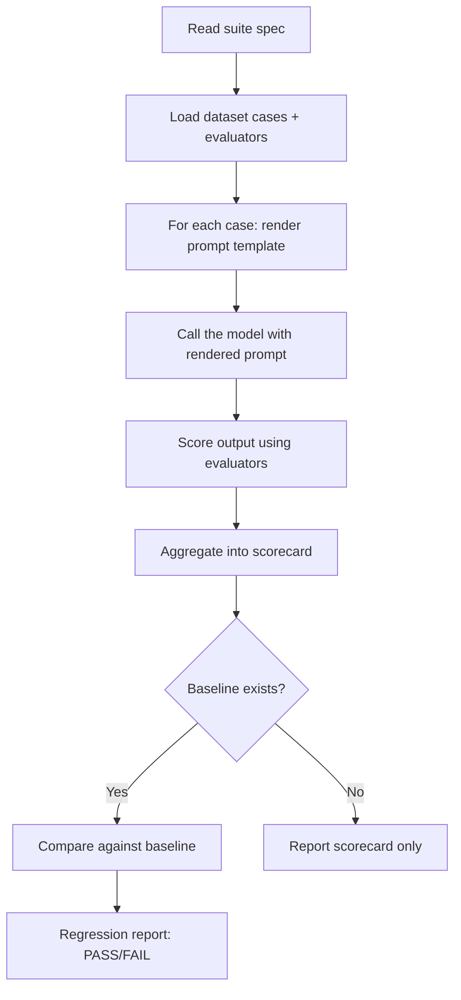

[](https://bintzgavin-apastra-14.mintlify.app/)


#### Works with projects written in:


etc.


## Trust-remediation candidate

The local runtime requires complete measured evidence and an explicit adapter. These repairs run locally and do not require GitHub Actions. The existing CI templates still need a separate repair before they can enforce evaluation results. See the [execution contract and migration notes](docs/guides/evaluation-trust.md).

## Quick Start

**Installing Apastra into your repo with help from a coding agent?**
Paste this:

```
Go to https://github.com/BintzGavin/apastra and start onboarding
```

Have no idea what an eval even is but know you're supposed to care? Don't worry, it'll walk you through everything step by step and explain how to write good ones. Your agent will stop multiple times to ask clarifying questions about what you actually care about. The flow is partly inspired by `gstack` by Garry Tan and by the `/grill-me` skill from Matt Pocock so it's very interactive.

## Eval the prompts and skills your coding agents depend on

Apastra is a Git-native EvalOps protocol and skill pack. Your chosen harness executes the target and evaluator. Apastra resolves the inputs and validates retained evidence before applying quality criteria. It fits beside execution frameworks through an explicit adapter and keeps the resulting records in your repository.

Use it to test the instructions your agents depend on, including skills and review workflows.

The hook layer makes that evidence easier to see while the agent is working. Codex and Claude Code hooks surface context, validation feedback, and safety signals when an agent reads a prompt, runs a tool, edits a file, or tries to stop. Relevant PromptOps changes also produce append-only validation receipts under `promptops/runs/hook-validations/`. Those receipts contain file paths, status, timestamps, and counts, but never prompt text, commands, file contents, or validation values.

## What is an eval actually?

Evaluating AI prompts via deterministic tests instead of just guessing how they are working. Like unit tests for your prompts.

## What Is This?

Apastra is a file-based protocol and skill pack for evaluating your agent's skills and prompts. 


| If you want to...                         | Apastra gives you...                                               |
| ----------------------------------------- | ------------------------------------------------------------------ |
| Test prompt behavior repeatedly           | Datasets, evaluators, and suites stored in Git                     |
| Catch quality regressions before shipping | Baselines, scorecards, and regression reports                      |
| Stay local-first                          | Agent-driven workflows with optional GitHub Actions automation     |
| Keep things inspectable                   | Plain files, schema validation, and reviewable diffs               |
| Debug agent behavior from traces          | Hook context, tool-call evidence, and artifact references          |
| See the context sent to a model            | Opt-in local OpenAI/Anthropic request logging for five adapters     |
| Version prompts like code                 | YAML prompt specs with stable IDs, variables, and output contracts |


## Is this actually lightweight?

Yes. It just sits in a folder and the agent calls it when it feels like it or when you tell it to. It uses some python scripts to run deterministic evals, but otherwise it's just yaml files. The only cost is when you run the evals, which is opt-in. So you can use it as much or as little as you want.

It has gotten more capable since it started (e.g. adding GitHub Actions support for automated regression testing). But the initial install and first eval are still very slim and you incrementally opt-in to everything else from there. You can also just ignore it and never use it and it will have no impact on you. Until you decide to opt into the GitHub actions CI at least.

## Documentation

- [Getting started](docs/guides/getting-started.md)
- [Architecture overview](docs/guides/architecture-overview.md)
- [Provider request logging](docs/guides/provider-request-logging.md)
- [API reference](docs/api)
- [System vision](docs/vision.md)

### 1. Install the skill pack

Two install paths — pick whichever fits your project.

**Option A — Git clone (language-agnostic, recommended):**

```bash
git clone --single-branch --depth 1 https://github.com/BintzGavin/apastra.git .agent/skills/apastra
.agent/skills/apastra/setup
```

Preview the exact writes first:

```bash
.agent/skills/apastra/setup --dry-run
```

**Option B — npm:**

```bash
APASTRA_POSTINSTALL_SETUP=1 npm install apastra
```

Plain `npm install apastra` is disclosure-only: it installs the package and prints the setup plan, but does not create project files. Set `APASTRA_POSTINSTALL_SETUP=1` only when you want npm's postinstall step to copy Apastra into the current project.

The install writes are:

- `.agent/skills/apastra/` — SKILL.md instructions your agent loads
- `.agent/scripts/apastra/` — deterministic Python runtime + shell validators
- `.agent/bin/apastra` — project-local CLI, including the opt-in request logger
- `.claude/skills/apastra` and `.agents/skills/apastra` — discovery symlinks, unless `APASTRA_NO_SKILL_SYMLINKS=1`

Optional writes and commands are opt-in:

- `APASTRA_INSTALL_AGENT_HOOKS=1` writes `.codex/config.toml`, `.codex/hooks.json`, `.claude/settings.json`, and a narrow `.gitignore` entry for `promptops/runs/hook-validations/` so Codex and Claude Code can surface trace and validation signals without adding local receipts to Git.
- `APASTRA_INSTALL_PY_DEPS=1` allows setup/postinstall to invoke `pip` for `pyyaml` and `jsonschema`; otherwise Apastra only checks for them and prints manual install guidance.
- `APASTRA_ASSUME_YES=1` lets the git-clone setup run non-interactively after printing the preflight manifest.

The default install posture is local and inspectable: no hosted service, no telemetry sink, no hidden database, no automatic hook config, and no cross-package-manager dependency install unless you opt in.

### Optional: inspect the real provider request

Provider request logging is off by default. To opt in, choose the coding-agent adapters, save directory, activation mode, and retention in the wizard:

```bash
.agent/bin/apastra request-log configure
```

It supports Codex, Claude Code, OpenCode, Pi, and generic OpenAI/Anthropic-compatible clients. Session-only launchers are the default; persistent routing is a separate reversible command. Complete request bodies are stored locally, while authentication headers are never persisted. See [Provider request logging](docs/guides/provider-request-logging.md).

### 2. Scaffold your first prompt workflow

Ask your agent:

> "Use the apastra-scaffold skill to create a prompt spec, dataset, evaluator, and suite for summarizing text"

You will get a repo-native setup like:

```text
promptops/
├── prompts/summarize-v1.yaml
├── datasets/summarize-smoke.jsonl
├── evaluators/contains-keywords.yaml
└── suites/summarize-smoke.yaml
```

### 3. Run an eval

Ask your agent:

> "Use the apastra-eval skill to run the summarize-smoke suite"

Configure a measured executable adapter before running the suite:

```bash
.agent/bin/apastra eval summarize-smoke --adapter promptops/harnesses/local.yaml --output-dir promptops/runs/candidate
```

The adapter executes each requested target and evaluator. A passing result requires complete evidence whose measured scores satisfy the suite's criteria.

### 4. Save a baseline

Ask your agent:

> "Use the apastra-baseline skill to set the current results as the baseline"

The baseline command admits a complete passing run under an immutable name. Compare a later candidate against that run using `gate --baseline ... --policy ... --adapter ...`.

Local evaluation and admission work without CI. Automated release remains blocked until the legacy workflows are repaired and verified.

> **Note for AI agents:** This README is the quickstart. For the full architectural model and design principles, start with `[docs/vision.md](docs/vision.md)`.

## Included Skills


| Skill                     | What it does                                                                                       |
| ------------------------- | -------------------------------------------------------------------------------------------------- |
| `apastra-getting-started` | Project setup and onboarding walkthrough                                                           |
| `apastra-writing-evals`   | Interactive eval design (paired workflow; link-disciplined reference to the Writing evals article) |
| `apastra-eval`            | Run evaluations from suites, score outputs, and compare baselines                                  |
| `apastra-trace`           | Inspect agent traces and turn tool-call evidence into eval cases or artifact refs                  |
| `apastra-baseline`        | Establish and manage known-good baselines                                                          |
| `apastra-scaffold`        | Generate prompt specs, datasets, evaluators, and suites                                            |
| `apastra-validate`        | Validate protocol files against JSON schemas                                                       |
| `apastra-red-team`        | Generate adversarial test cases                                                                    |
| `apastra-setup-ci`        | Install the GitHub Actions workflows for regression gating and release                             |


All skills install together — there is no per-skill install path. Once installed under `.agent/skills/apastra/`, your agent discovers each sub-skill by its `SKILL.md`.

## Core Concepts

### Prompt Spec

A YAML file defining a prompt with a stable ID, input variables, a template, and an optional output contract.

```yaml
id: summarize-v1
variables:
  text: { type: string }
template: "Summarize: {{text}}"
```

### Dataset

A `.jsonl` file of test cases — one JSON object per line with a `case_id` and `inputs`.

```jsonl
{"case_id": "case-1", "inputs": {"text": "..."}, "expected_outputs": {"should_contain": ["key", "words"]}}
```

### Evaluator

A scoring rule — deterministic checks, schema validation, or AI judge grading.

```yaml
id: keyword-check
type: deterministic
metrics: [keyword_recall]
metric_definitions:
  keyword_recall: {version: "1.0.0", direction: higher_is_better, unit: ratio}
```

### Inline Assertions (Quick Mode)

For simple checks, skip the evaluator file entirely — put assertions directly on your test cases. Prefer checks that prove the behavior you care about: final outcome first, then critical step choices, then trace evidence when the path matters.

```jsonl
{"case_id": "agent-run-ready", "inputs": {"final_response": "...", "trace_summary": "..."}, "assert": [{"type": "is-valid-json-schema", "value": {"type": "object"}}, {"type": "contains-all", "value": ["outcome_evidence", "step_evidence", "trace_evidence"]}]}
```

Built-in assertion types: `equals`, `contains`, `icontains`, `contains-any`, `contains-all`, `regex`, `starts-with`, `is-json`, `contains-json`, `is-valid-json-schema`, `similar`, `llm-rubric`, `factuality`, `latency`, `cost`. Negate any with `not-` prefix (e.g. `not-contains`).

### Quick Eval (Single File)

For rapid iteration, combine prompt + cases + assertions into one file. A strong release-readiness quick eval can separate final outcome, critical step, and trace evidence:

```yaml
id: agent-run-readiness
prompt: |
  Evaluate a completed AI-agent implementation run for release readiness.
  Return JSON with decision, outcome_evidence, step_evidence, trace_evidence, risks, and next_action.

  Final response: {{final_response}}
  Outcome evidence: {{outcome_evidence}}
  Step evidence: {{step_evidence}}
  Trace evidence: {{trace_evidence}}
cases:
  - case_id: validated-promptops-change
    metadata:
      evidence_surfaces: [outcome, step, trace]
    inputs:
      final_response: "Updated the quick eval and validation passed."
      outcome_evidence: "[QE-OUTCOME-001] Changed promptops/evals/agent-run-readiness.yaml."
      step_evidence: "[QE-STEP-001] Ran quick-eval validation after editing promptops/evals/."
      trace_evidence: "[QE-TRACE-001] validation_status=passed before final response."
    assert:
      - type: is-valid-json-schema
        value: { type: object, required: [decision, outcome_evidence, step_evidence, trace_evidence] }
      - type: contains-all
        value: ['"outcome_evidence"', '"step_evidence"', '"trace_evidence"', QE-OUTCOME-001, QE-STEP-001, QE-TRACE-001]
thresholds:
  pass_rate: 1.0
```

Graduate to the full spec/dataset/evaluator/suite structure as complexity grows.

### Suite

A test configuration that ties everything together: which datasets, which evaluators, which models.

```yaml
id: smoke
name: Smoke Suite
prompt: summarize-v1
datasets: [summarize-smoke]
evaluators: [keyword-check]
model_matrix: [default]
thresholds: { keyword_recall: 0.6 }
```

### Baseline & Regression

A baseline records an admitted passing run and its content identity. Regression compares compatible runs under explicit rules, including metric versions and units.

## File Structure

### In your project (after install)

```
.agent/
├── skills/apastra/       # Agent-facing SKILL.md files (eval, baseline, scaffold, …)
└── scripts/apastra/      # Deterministic runtime (Python + shell validators)
.codex/                   # Codex hook config for context, trace, validation feedback
.claude/                  # Claude Code hook config for the same feedback loop
promptops/                # Created by the scaffold skill on first use
├── prompts/              # Prompt specs (YAML)
├── datasets/             # Test cases (JSONL)
├── evaluators/           # Scoring rules (YAML)
├── suites/               # Test configurations (YAML)
└── policies/             # Regression policies (allowed thresholds)
derived-index/
├── baselines/            # Known-good scorecards
└── regressions/          # Regression reports
```

### In this repo (what gets shipped)

`promptops/` here contains the runtime source that lands in your project's `.agent/scripts/apastra/` at install time — schemas, validators, resolver, runs, harnesses, and the opt-in provider request logger. The project-local CLI lands at `.agent/bin/apastra`. You do not copy these directories into your project directly; `setup` / `postinstall.sh` does that.

## How the Agent Runs Evals

An IDE agent can provide execution through a declared adapter. The same runner admits evidence from CLI and MCP entry points:


```mermaid
flowchart TD
  A[Read suite spec] --> B[Load dataset cases + evaluators]
  B --> C[For each case: render prompt template]
  C --> D[Call the model with rendered prompt]
  D --> E[Score output using evaluators]
  E --> F[Aggregate into scorecard]
  F --> G{Baseline exists?}
  G -->|Yes| H[Compare against baseline]
  G -->|No| I[Report scorecard only]
  H --> J[Regression report: PASS/FAIL]
```


Deterministic steps (prompt rendering, digest computation, scorecard normalization, baseline comparison, schema validation) are delegated to Python + shell scripts under `.agent/scripts/apastra/`. Your agent handles the LLM-dependent parts: calling the model and grading with judge evaluators. Hooks give the agent a better trace surface while it works; durable traces should be stored as run artifacts or `artifact_refs.json` entries, not as hidden platform state. No hosted service, no SaaS dependency — just files, scripts, and your agent.

---

## Scaling Up (Optional)

When you're ready for more structure, apastra supports:

### GitHub Actions CI

The local `ci-gate` command checks the tested revision and its resolved inputs.
It supports explicit execution and previously produced evidence. Missing or
stale evidence fails admission.

The repository workflows and templates still need the approved remediation.
Their current presence does not establish safe merge gating or automated delivery.
Do not copy the templates into another project until that work is complete.

### Git-First Consumption

Apps can pin prompts by commit SHA, tag, or semver — npm and pip both support Git dependencies natively:

```yaml
# consumption.yaml
version: "1.0"
prompts:
  summarize-v1:
    id: summarize-v1
    pin: "abc123"  # commit SHA, tag, or semver
```

Resolution order: local override → workspace → git ref → packaged artifact.

### Governed Releases


| Packaging            | When to use                                  |
| -------------------- | -------------------------------------------- |
| Git ref (tag/SHA)    | Default — zero publishing overhead           |
| GitHub Release asset | Governed releases with optional immutability |
| OCI artifact         | Org-wide digest-addressed distribution       |


---

## Principles

- **Files in Git are the source of truth** — not a database, not a platform
- **Your agent is the harness** — no framework lock-in
- **Trace evidence beats vibes** — tool calls, validation feedback, and stopping conditions should become inspectable evidence when they matter
- **Provider requests can be inspected explicitly** — complete request bodies are available through an opt-in, loopback-only, credential-free local log
- **Append-only artifacts** — never mutate old results; create new records
- **Reproducibility by default** — content digests, environment metadata
- **Local-first, CI-optional** — start with zero infrastructure

## Roadmap (beyond included skills)

Shipped skills are listed under **Included Skills** above (including `apastra-red-team`). Everything here is **extra surface area**: some pieces already exist in the runtime or as schemas, while the agent-facing skill or production hardening is still to come. For depth and evolving status, see [docs/vision.md](docs/vision.md) (expansion backlog).


| Capability                                                         | Status                          | Today / next                                                                                                                                                                                                                   |
| ------------------------------------------------------------------ | ------------------------------- | ------------------------------------------------------------------------------------------------------------------------------------------------------------------------------------------------------------------------------ |
| `**apastra-audit`** — scan for hardcoded prompts and "prompt debt" | Partial — runtime               | `promptops/runtime/audit.py`, CLI `audit`, `audit-shim.sh`. **Missing:** dedicated `apastra-audit` skill.                                                                                                                      |
| **Drift / canaries** | Unsupported | The runtime returns unsupported. Scheduling, alert delivery, and rollback remain unimplemented. |
| **Multi-model comparison** | Local runtime | An explicit adapter executes every requested model. Complete evidence and shared suite budgets are required before a comparison is persisted. |
| **Automated prompt review** | Not implemented | The legacy `apastra-review` CLI command reports unsupported analysis. Use the Apastra skill workflows for review. |
| **Automated prompt optimization** | Not implemented | The legacy `apastra-optimize` CLI command reports unsupported analysis. Use the Apastra skill workflows for optimization. |
| **Community / starter packs**                                      | Partial — artifacts             | Starter pack JSON under `derived-index/starter-packs/` (summarization, extraction, classification, code review). **Missing:** curated installable repos and public registry story.                                             |
| **Observability adapters** | Schema-only | Delivery commands return unsupported and emit no receipts. |


## Planned Refinements

- **Simplified minimal mode** — auto-detected when few prompt specs exist; default layout trimmed to `prompts/`, `evals/`, and `baselines/` only
- **Project-level config** — **shipped at runtime:** upward-discovered `promptops.config.yaml` / `.yml` with schema and default application; documentation of precedence rules still improving
- **MCP integration** — **partial:** MCP server and tools in `promptops/runtime/mcp_server.py` (e.g. list suites, run evaluation); richer MCP definitions inside prompt specs and packaging remain roadmap
- **Measured cost**: cost budgets require a valid measurement. Optional cost fields remain absent when unmeasured.
- **Hook receipt conversion**: provider request-body logging and redacted lifecycle validation receipts are shipped; converting selected receipts into eval cases without copying full transcripts remains roadmap work

## License

Apache-2.0

## Evaluate assistant changes from Kody

Use the [supported workspace MCP workflow](docs/guides/kody-evaluation-workflow.md)
for authenticated HTTP startup, asynchronous evaluations, explicit baseline
comparison, inspectable case evidence, and a deterministic regression/fix demo.
The reusable Kody package source ships in `promptops/integrations/kody/apastra/`.
