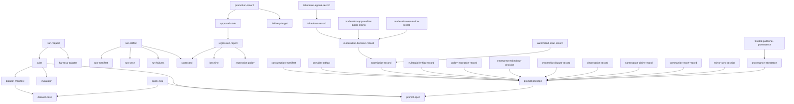

# Schema Dependency Graph

This document visualizes the dependencies between different schemas in the PromptOps ecosystem.

```mermaid
graph TD
    %% Core Schemas
    PromptSpec[prompt-spec]
    DatasetCase[dataset-case]
    DatasetManifest[dataset-manifest]
    Evaluator[evaluator]
    Suite[suite]
    QuickEval[quick-eval]

    %% Runtime Schemas
    RunRequest[run-request]
    HarnessAdapter[harness-adapter]
    RunManifest[run-manifest]
    RunCase[run-case]
    RunFailures[run-failures]
    RunArtifact[run-artifact]
    Scorecard[scorecard]

    %% Governance Schemas
    Baseline[baseline]
    RegressionPolicy[regression-policy]
    RegressionReport[regression-report]
    ApprovalState[approval-state]
    PromotionRecord[promotion-record]
    DeliveryTarget[delivery-target]

    %% Consumption
    ConsumptionManifest[consumption-manifest]
    PromptPackage[prompt-package]
    ProviderArtifact[provider-artifact]

    %% Moderation & Governance
    SubmissionRecord[submission-record]
    ModerationDecisionRecord[moderation-decision-record]
    AutomatedScanRecord[automated-scan-record]
    VulnerabilityFlagRecord[vulnerability-flag-record]
    PolicyExceptionRecord[policy-exception-record]
    EmergencyTakedownDecision[emergency-takedown-decision]
    TakedownRecord[takedown-record]
    TakedownAppealRecord[takedown-appeal-record]
    OwnershipDisputeRecord[ownership-dispute-record]
    DeprecationRecord[deprecation-record]
    NamespaceClaimRecord[namespace-claim-record]
    CommunityReportRecord[community-report-record]
    MirrorSyncReceipt[mirror-sync-receipt]
    ProvenanceAttestation[provenance-attestation]
    TrustedPublisherProvenance[trusted-publisher-provenance]
    ModerationApprovalForPublicListing[moderation-approval-for-public-listing]
    ModerationEscalationRecord[moderation-escalation-record]

    %% Dependencies
    Suite --> PromptSpec
    Suite --> DatasetManifest
    Suite --> Evaluator

    DatasetManifest --> DatasetCase

    QuickEval --> PromptSpec
    QuickEval --> DatasetCase

    RunRequest --> Suite
    RunRequest --> HarnessAdapter

    RunArtifact --> RunManifest
    RunArtifact --> RunCase
    RunArtifact --> RunFailures
    RunArtifact --> Scorecard

    RegressionReport --> Scorecard
    RegressionReport --> Baseline
    RegressionReport --> RegressionPolicy

    ApprovalState --> RegressionReport

    PromotionRecord --> ApprovalState
    PromotionRecord --> DeliveryTarget

    ConsumptionManifest --> PromptPackage
    PromptPackage --> PromptSpec
    ProviderArtifact --> PromptPackage

    SubmissionRecord --> PromptPackage
    ModerationDecisionRecord --> SubmissionRecord
    AutomatedScanRecord --> SubmissionRecord
    VulnerabilityFlagRecord --> PromptPackage
    PolicyExceptionRecord --> PromptPackage
    EmergencyTakedownDecision --> PromptPackage
    TakedownRecord --> ModerationDecisionRecord
    TakedownAppealRecord --> TakedownRecord
    OwnershipDisputeRecord --> PromptPackage
    DeprecationRecord --> PromptPackage
    NamespaceClaimRecord --> PromptPackage
    CommunityReportRecord --> PromptPackage
    MirrorSyncReceipt --> PromptPackage
    ProvenanceAttestation --> PromptPackage
    TrustedPublisherProvenance --> ProvenanceAttestation
    ModerationApprovalForPublicListing --> ModerationDecisionRecord
    ModerationEscalationRecord --> ModerationDecisionRecord
```
