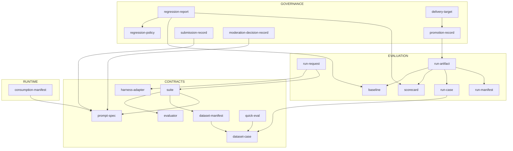

# Schema Dependency Graph

This dashboard visualizes the relationships and dependencies between schemas across different domains.

```mermaid
flowchart TD
  subgraph CONTRACTS
    PS[prompt-spec]
    DM[dataset-manifest]
    DC[dataset-case]
    E[evaluator]
    S[suite]
    HA[harness-adapter]
    QE[quick-eval]
  end

  subgraph EVALUATION
    RR[run-request]
    RA[run-artifact]
    RM[run-manifest]
    RC[run-case]
    SC[scorecard]
    B[baseline]
  end

  subgraph GOVERNANCE
    RP[regression-policy]
    RRep[regression-report]
    PR[promotion-record]
    DT[delivery-target]
    SR[submission-record]
    MDR[moderation-decision-record]
  end

  subgraph RUNTIME
    CM[consumption-manifest]
  end

  S --> PS
  S --> DM
  S --> E
  DM --> DC
  QE --> DC

  RR --> S
  RR --> HA

  RA --> RM
  RA --> RC
  RA --> SC
  RA --> B
  RC --> DC

  RRep --> SC
  RRep --> B
  RRep --> RP

  PR --> RA
  DT --> PR
  SR --> PS
  MDR --> PS

  CM --> PS
```
