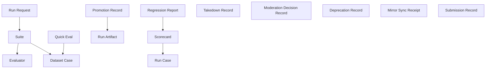

# Schema Dependency Graph

```mermaid
graph TD
  A[Run Request] --> B[Suite]
  B --> C[Evaluator]
  B --> D[Dataset]
  E[Scorecard] --> F[Run Case]
  G[Regression Report] --> E
  H[Promotion Record] --> I[Run Artifact]
  J[Quick Eval] --> D[Dataset Case]
  K[Takedown Record]
  L[Moderation Decision Record]
  M[Deprecation Record]
  N[Mirror Sync Receipt]
  O[Submission Record]
```
