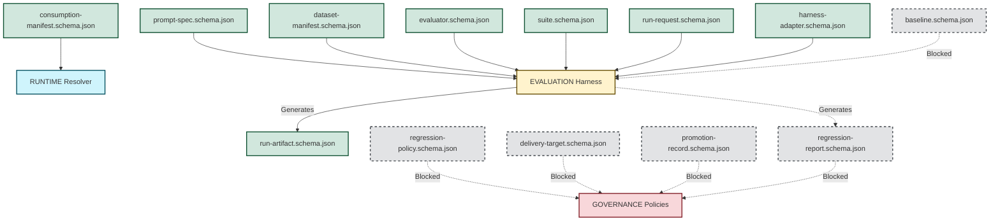

# Schema Dependency Graph

This dashboard visualizes how different domains rely on schemas provided by the CONTRACTS domain and outputs generated by other domains.

## Overview of Dependencies

The core architecture treats `CONTRACTS` as the foundational domain providing schemas that other domains use for structured data validation. `EVALUATION` relies on these schemas to generate concrete reports, which `GOVERNANCE` then uses to evaluate policies.

## Interface Details

### RUNTIME Domain Interfaces
The RUNTIME domain relies on the `consumption-manifest.schema.json` contract to validate app-side pinning and overrides during resolution.

### EVALUATION Domain Interfaces
The EVALUATION domain consumes almost all core models:
- Consumes `run-request.schema.json` to instruct execution.
- Consumes `harness-adapter.schema.json` to configure the execution environment.
- Validates the target assets against `prompt-spec.schema.json`, `suite.schema.json`, `dataset-manifest.schema.json`, and `evaluator.schema.json`.
- Yields a structured directory conforming to `run-artifact.schema.json`.
- *Blocked:* Needs `baseline.schema.json` to establish regression starting points.

### GOVERNANCE Domain Interfaces
The GOVERNANCE domain consumes policies and acts on evaluation outputs:
- *Blocked:* Needs `regression-policy.schema.json` to define gating logic.
- *Blocked:* Needs `regression-report.schema.json` (from EVALUATION) to make pass/fail decisions.
- *Blocked:* Needs `delivery-target.schema.json` and `promotion-record.schema.json` to handle approved rollouts.
