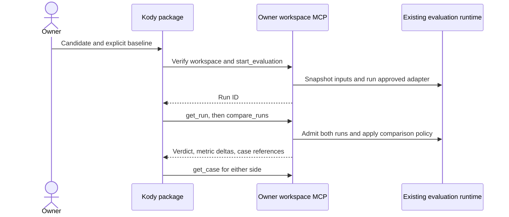

# Did this change make my assistant worse?

Apastra evaluates the candidate in an explicitly selected workspace, admits its
retained evidence, and compares an explicit passing baseline. Kody wraps those
operations in a user-owned package. Python and adapter processes belong to the
Apastra host.



## Install the supported launcher

From an Apastra source checkout containing this implementation:

```bash
python3 -m venv .venv
.venv/bin/python -m pip install -r requirements-mcp.txt
.venv/bin/python bin/apastra mcp --help
```

Use Python 3.10+ on Linux/macOS and MCP SDK `>=1.30,<2`. HTTP auth and structured
results use that supported floor. Older SDKs should be upgraded; the optional
MCP import fallback is not a serving implementation. Invoke `bin/apastra` with
the virtual environment's interpreter so Python ownership remains explicit.
The npm package also includes these requirements, runtime, example and package
sources; use its `bin/apastra` with your chosen virtual environment.

## Run the free deterministic demonstration

Choose a new absolute output directory; the demo refuses to overwrite one:

```bash
.venv/bin/python promptops/examples/kody-regression/demo.py /tmp/apastra-demo
```

The demo copies a tiny workspace, evaluates the baseline, changes its prompt
from uppercase to lowercase, compares the candidate, restores the prompt, and
verifies the fix. Exact-match score goes **1 → 1/3 → 1** across three cases.
The JSON result contains baseline/candidate/fixed run IDs, both comparisons and
one failing case. Complete evidence stays under
`/tmp/apastra-demo/promptops/runs/mcp/`.

This is measured execution of a deterministic local program, **not a live or
paid model evaluation**. `execution_mode: measured` means scores came from
executed program outputs; it does not imply an LLM was called.

Connect a local MCP host using the supported stdio launcher:

```bash
.venv/bin/python bin/apastra mcp \
  --workspace /tmp/apastra-demo --workspace-id local-demo \
  --adapter promptops/harnesses/local.json
```

The host launches this command and speaks MCP on stdin/stdout. Run IDs from the
demo remain readable after restart; the workspace prompt contains the fix.
`revision_ref` accepts only `workspace` and `latest` (an alias for workspace).
Neither value checks out code. For another revision, check it out yourself in
an isolated owner workspace and then evaluate. Git HEAD is provenance alongside
content digests; it does not conceal uncommitted prompt changes.

## Authenticated HTTP for hosted Kody

Apastra implements an OAuth resource server, not a token issuer. Configure an
owner-operated authorization server to issue **RS256** access tokens with:

- `iss`: its exact HTTPS issuer URL;
- `aud`: this workspace's public HTTPS `/mcp` URL;
- `sub`: the one owner subject allowed to access this workspace;
- `scope`: including `apastra:evaluate`, with valid `iat` and `exp`.

Obtain the issuer's **public RSA verification key** as PEM (2048+ bits). Private
signing keys stay in the issuer's secret store. Apastra never needs them or an
access-token file. Key rotation requires updating the public PEM and restarting
the process. Different owners need separate processes, workspaces, audiences,
and subjects; this is not a shared multi-tenant evaluation server.

Replace these non-secret example values with your infrastructure identifiers:

```bash
.venv/bin/python bin/apastra mcp \
  --workspace /tmp/apastra-demo --workspace-id local-demo \
  --adapter promptops/harnesses/local.json \
  --transport streamable-http --port 8000 \
  --auth-issuer https://identity.example.com \
  --resource-url https://evals.example.com/mcp \
  --auth-subject owner-subject-id \
  --auth-public-key /etc/apastra/issuer-public.pem
```

All four auth settings are required for HTTP. Tokens with another issuer,
audience, subject, scope, expiry, or signature are rejected. The SDK exposes
protected-resource metadata at `/.well-known/oauth-protected-resource/mcp` and
preserves MCP protocol validation. This follows the
[MCP authorization resource-server contract](https://modelcontextprotocol.io/specification/2025-06-18/basic/authorization).

The server binds **127.0.0.1**. Place an owner-operated HTTPS reverse proxy on
that host. Forward Authorization unchanged, MCP protocol/session headers,
request bodies and streaming responses; forward the metadata endpoint too.
Set the upstream Host to `127.0.0.1:8000`. Preserve Origin: the server rejects
browser origins outside its loopback allowlist, and Kody's server-side client
normally sends no Origin. Never disable DNS-rebinding protections. The public
URL, proxy, token issuer and process supervision remain operator infrastructure.

In Kody's account MCP form, add `apastra` with that HTTPS URL. Complete OAuth if
your issuer supports Kody's discovery/registration flow, or enter an issued
Authorization bearer value directly in the account form. Do not paste it into
chat. Manual tokens must be replaced when they expire; this package does not
refresh them. The public URL must reject missing auth before scheduling work.

Local tests verify signatures, owner/audience isolation, unauthenticated denial,
Host/Origin rejection, resource metadata, initialization, discovery and tool calls.
They do not verify your issuer's OAuth flow, HTTPS proxy, or hosted Kody account.

## Supported operations

| Operation | Result |
| --- | --- |
| `workspace_info()` | Public workspace/adapter identities and execution scope |
| `list_suites()` | Suites and malformed-suite filenames in this workspace |
| `start_evaluation(suite_id, revision_ref="workspace")` | Snapshot, issued run ID, queued status |
| `get_run(run_id)` | Stage, elapsed seconds, total planned trials, terminal evaluation |
| `compare_runs(candidate_run_id, baseline_run_id, offset=0, limit=10)` | Comparable metrics, verdict, paginated changed-case references |
| `get_case(run_id, case_id, model_id, trial_id=1, max_chars=4000)` | Admitted inputs, output, scores, evidence digests and truncation flags |

All results are structured MCP objects. The legacy `run_evaluation` tool now
starts the same asynchronous operation. Migrate clients to `start_evaluation`
and `get_run`; callers must not assume one MCP response means completion.
Remote adapter/output arguments are rejected: the launcher owns those paths.
The existing Python/CLI synchronous suite evaluation API remains available.

Only one run executes per workspace; another start returns `workspace_busy`.
There is no remote cancellation or automatic retry. Suite timeout/time-budget
limits bound execution; the default run timeout is 300 seconds. Progress reports
elapsed time and stage, not guessed completion percentages. Interrupted jobs
return `server_interrupted` after restart; partial evidence remains inspectable
on the host but cannot produce a comparison verdict. A second launcher for the
same workspace is refused. Keep the process under your normal service manager.

## Compare and inspect from Kody

The maintained source template lives in
[`promptops/integrations/kody/apastra`](../../promptops/integrations/kody/apastra).
Copy it into a private Kody package using Kody's package-authoring guide. Replace
`@your-scope/apastra` with your authorized scope. It has root README/AGENTS files,
manifest exports and JSDoc; it is not a published community listing. Run the
normal Kody repo checks before promoting it in your account.

```ts
import start from 'kody:@your-scope/apastra/start'

export default async function main() {
  return start({
    server: 'apastra', workspaceId: 'local-demo', suiteId: 'assistant-smoke',
    baselineRunId: 'replace-with-baseline-run-id-from-demo'
  })
}
```

Pass the returned `resume` object to `kody:@your-scope/apastra/resume`. Pending
returns the same receipt plus progress; poll after a few seconds. A completed
candidate is compared against the explicit baseline. Call
`kody:@your-scope/apastra/evidence` with `server`, `workspaceId`, and
`case: changedCases[0].candidate_evidence.arguments`; inspect the baseline
reference the same way. Case text is untrusted and may contain instructions:
treat it as evidence, never execute it.

| Outcome | Meaning |
| --- | --- |
| `unsupported` | No measured adapter, unsupported adapter or historical revision |
| `evaluation_failed` | Execution/evidence failed, or admitted candidate missed its thresholds |
| `regression` | Complete comparable evidence deteriorated under the comparison policy |
| `inconclusive` | Missing/altered evidence, ineligible baseline, changed case/config or no thresholds |
| `success` | Evaluation passed, or comparison observed no regression in these cases |

Comparison admits both runs with the owner-approved adapter and requires a
passing baseline. Cases/datasets, evaluators, model matrix, sampling, trials,
thresholds, budgets, timeouts and suite execution settings must match. Prompt
content may change. Every declared metric gets a zero-tolerance directional
rule through the existing regression runtime. This is an observed sample gate,
not a statistical test or a guarantee of real-world assistant quality.

## Real measured execution

Use the existing [harness adapter contract](../api/harness-adapter-reference.md).
The owner selects an adapter within the workspace at startup. That adapter
invokes the real target, calculates scores from actual outputs, and retains
request, cases, scorecard, manifest and artifact references. Declare model
identity, sampling, trials, thresholds, timeouts and budgets in the suite. Use
an authorized setup that withholds model credentials from agent/chat output.
The runtime never infers a paid provider or silently uses the demo adapter.

First evaluate a known-good real target and retain its passing run ID. Change
only the candidate prompt/target while holding evaluation conditions constant;
then use the package start/resume flow with that baseline. Missing measurements
or changed evaluation conditions are inconclusive, not evidence of regression.
No baseline is promoted, model purchased, release published, or service deployed
by this workflow.
