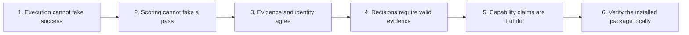

# P0 remediation: trustworthy evaluation and comparison

Status: runtime repairs implemented and locally verified. On September 6, 2026, the user approved keeping the fixes and tests, dropping the broad CI redesign, and handling the existing CI false-pass bug separately. Publication remains uncompleted.

Owner: the coordinating Apastra review task. The cleanup task handed over its changes, repaired the installed package in a bounded follow-up, and completed a read-only adversarial review. The isolated candidate is `/private/tmp/apastra-trust.hQdcnc/checkout` on `gavin/fix-evaluation-trust`. Original main-checkout changes and research remain untouched.

## Approved scope

Keep the implemented runtime repairs and their regression tests, including the installed-package fixes. GitHub Actions remains optional. This change adds no CI jobs and preserves existing check names, branch protection, and release automation. The rejected broad workflow patch was never applied.

The local `ci-gate` command and its execute/evidence tests are implemented. They do not prove that GitHub enforces those checks. CI-01 through CI-04 and the remote-CI portion of CI-08 are deferred to a separate change. The remaining rows describe local behavior and package acceptance. Broader changes to validation workflows and tag publication are dropped from this release scope.

### Separate CI false-pass repair

The existing report gate skips when the artifacts branch is absent and defaults to a warning when its report is missing. It also accepts a report without checking the tested revision. These are inherited workflow defects. The runtime repairs do not close them.

Keep the follow-up limited to the existing gate and its distributed template. Preserve job/check names and triggers. Use the existing runtime admission command if the producer supplies its required evidence. If that producer contract is absent, report that enforcement is unavailable and keep the check ineligible to authorize a merge.

Acceptance tests for that separate repair:

- Given an evaluation that requires enforcement, missing or malformed evidence makes the existing gate fail.
- Given a report for another revision, the gate rejects it even when it says `pass`.
- Given complete passing or failing evidence for the tested revision, the gate returns the matching outcome.
- Given a repository that has not configured evaluation, its documentation identifies the check as non-enforcing. A skipped check supplies no quality claim.
- Existing workflow names, triggers, permissions, and release behavior remain unchanged.

Live-model CI and mandatory dogfooding are outside this work. The unchanged templates remain unsuitable for required evaluation checks until this follow-up is verified.

## Outcome and scope

Apastra is a Git-native EvalOps protocol and skill pack: it specifies evaluations, invokes a declared harness, records evidence, and applies release policy. The harness supplies execution and evaluator capabilities. This follows [ADR 002](../decisions/adr-002-byo-harnesses.md) and the [vision's non-goals](../vision.md#non-goals).

The P0 invariant is: **a pass must be justified by complete, valid evidence from the requested execution and an explicit decision policy. Missing work, missing evidence, unsupported functionality, and fixture output must never authorize a baseline, merge, promotion, or release.**

Execution completion, evaluation outcome, signature verification, and artifact delivery are separate facts. A successful subprocess or schema parse proves none of the other facts by itself. A real evaluation can complete and correctly report that the tested system failed.

P0 covers trust failures in the existing product surface. It does not add a hosted platform, a provider abstraction, a prompt optimizer, a registry service, statistical research features, or a replacement for observability tools. BYO execution and optional CI remain intentional. Advanced judge calibration, confidence intervals, additional framework adapters, observability integrations, and automated canary rollback follow after this plan.

## Handoff and evidence

Review base: `a383e6c3b5545accabe9d938a5ae434383770680`. Cleanup changes are present and uncommitted in the main checkout. The cleanup-only review branch is `gavin/chore-slop-cleanup` in the other task's isolated worktree. Existing untracked research assets are outside this remediation's acceptance baseline.

| Cleanup finding | Received changes | Remaining acceptance work |
| --- | --- | --- |
| A1: fake signature verification | Claimed signatures now raise unsupported; unsigned assets return unverified. | Verify the public resolver and any trust-required consumer cannot ignore this distinction. Real cryptography is not required for P0 if signed verification remains explicitly unsupported. |
| A2: fabricated comparison metrics | Adapter required; runner failures and missing scorecards raise; measured metric fields are retained; absent tradeoffs are omitted. | Reject fixture execution, empty metrics/cases, wrong model identity, incomplete runs, and invalid evidence. Preserve the underlying evidence after comparison. |
| A3: canned review/optimization | Legacy commands fail explicitly; README entries corrected. | Align remaining documentation and supported-command claims. |
| A4: duplicated manifest validation | Resolution uses the existing Python validation boundary. | Prove the same acceptance/rejection behavior through the installed package, including malformed manifests. |
| A5: repeated validator plumbing | 53 compatibility entry points use a new shared dispatcher; dataset validation retains two inputs. The coordinator fixed the introduced offline AJV lookup regression after handoff. | Include the new dispatcher and integrity tests with the patch; full distributed-package acceptance remains open. This refactor alone does not make schemas strict. |

The formal handoff is `/private/tmp/apastra-slop-handoff.md`; its durable facts are summarized here because temporary files are not release evidence. Originating task: `01a06f93-40be-7711-b4fb-ec0ebf42c47f`. Independent cleanup review: `01a0717f-5013-7401-8d27-e1ce267448af`; the coordinator read its final report on September 5. It confirmed one introduced P2, the offline validator regression described below, and no additional introduced Apastra defect within its scope. No commit, push, or publish is implied by this plan.

Handoff follow-up: the independent reviewer confirmed the cleanup introduced an offline failure despite AJV being available on the executable search path. Three new offline tests failed before the coordinator changed the helper to resolve installed package dependencies first, then use an available AJV executable, otherwise fail explicitly. All eight validator tests now pass, including valid/invalid inputs from unrelated directories, paths containing spaces, and a missing-dependency case with npm/npx forbidden. The review snapshot remains unchanged; these finalized changes belong to a subsequent candidate.

Three targeted helper mutations were caught after the same three-test baseline passed: bypass validation, ignore available AJV, and resolve dependencies from the caller's directory. Each mutant produced behavioral assertion failures with no test setup errors; the source checkout was not mutated by that diagnostic.

The originating task copied the two finalized files into a new isolated release candidate and independently passed all eight validator tests. The original review snapshot is unchanged. The independent review's broader Apastra run executed 115 tests: 114 passed and the old validator dependency case failed; that full suite has not been rerun against the new candidate. Its 53-wrapper schema-selection/argument matrix had no mismatches. This closes the introduced validator finding at the focused-test level, not the remaining P0 acceptance gates.

A fresh independent review of the repaired candidate subsequently confirmed no introduced regression within its scope. It passed 30 focused Apastra tests and exercised all 53 changed validator entry points outside the workspace, including schema compilation and invalid-root rejection. It also verified the shared helper is included in the actual npm tarball. Provider-logging/hook suites and a fresh online dependency installation were outside that review. Report: `/Users/gavinbintz/Documents/Codex/2026-09-05/perform-a-comprehensive-adversarial-review-from-2/outputs/adversarial-review.md`.

The reviewer also reproduced an inherited release blocker on both base and candidate: the npm package omits `promptops/manifests`, causing `bin/apastra compare --help` to fail at import. The initial review used npm-selected packed-file layouts; the fresh review reproduced the same failure by extracting actual base/candidate tarballs and invoking `bin/apastra --help` with Python dependencies available. Track this specifically under CI-07; the offline validator repair does not resolve it. The initial report is `/Users/gavinbintz/Documents/Codex/2026-09-05/perform-a-comprehensive-adversarial-review-from/outputs/review.md`.

Fresh coordinator verification:

- 22 focused tests across runtime integrity, resolver safety/workspace resolution, assertion evaluation, and validator scripts passed. Initially 21 passed and the outside-workspace validator failed on npm DNS access; its network-enabled rerun passed. This is not proof of offline installation.
- MCP `run_evaluation("apastra-local-first-eval-lifecycle-smoke")` still returned `status: success` with empty `normalized_metrics` and `metric_definitions`.
- Comparing two synthetic model IDs through the explicit reference adapter still exited successfully with empty metrics for both models. No model was invoked.
- Missing cost and latency metadata, an empty rubric without a judge, a negated unknown assertion, and a negated invalid regex each produced a passing assertion score.
- The cleanup's subprocess test writes an empty case file and no metric definitions. It proves process invocation and metric transport, not valid evaluation evidence. Replace its positive fixture with a complete contract fixture and keep the empty variant as a negative test.

Correction to the initial review: six workflow templates are tracked under `setup-ci/templates/.github/workflows/`. They are not missing. The verified problems are inaccurate execution claims, divergent gate implementations, incomplete change coverage, and unverified installed-package behavior. The earlier broad asset-validation count should be rerun with correct asset classification rather than treated as a P0 exit baseline.

## Execution order

Each item starts with a failing behavioral test, then implementation, then the smallest relevant integration checks. Complete the exit gate before treating that item as done. Cleanup findings are credited only to the behaviors their tests establish.

### P0-1 — Eliminate false-success eval and comparison paths

Status: implemented and locally verified. See the current verification record for results.

Primary surfaces: [reference adapter](../../promptops/harnesses/reference-adapter/run.py), [runner](../../promptops/runtime/runner.py), [runner shim](../../promptops/runs/runner-shim.sh), [MCP](../../promptops/runtime/mcp_server.py), [comparison](../../promptops/runtime/compare.py), and [CLI](../../promptops/runtime/cli.py).

Implement in this order:

1. Preserve the adapter-required cleanup. Remove the implicit reference adapter selection from normal MCP execution. Resolve a user-configured executable harness; otherwise report unsupported execution before producing evaluation artifacts.
2. Make reference/fixture and dry-run modes explicit and ineligible for quality gates. Remove synthetic cost, output, and successful-evaluation claims from the production path. Directly invoking the reference adapter must not bypass this boundary.
3. Apply a common acceptance boundary to every run entry point, including the shell shim. Reject failed manifests, empty required metrics/cases, incomplete model/case/trial coverage, and mismatched request identity even when the harness exits zero.
4. Make comparison all-or-error for its requested model set. Preserve valid metric names and values, omit genuinely unmeasured optional tradeoffs, and retain addressable per-model run evidence. Never publish an ordinary comparison or winner from partial execution.

Define one observable outcome vocabulary across CLI, MCP, and persisted artifacts:

| Outcome | Meaning | Can authorize a quality gate? |
| --- | --- | --- |
| `pass` | Required measured execution completed, evidence validated, declared criteria satisfied. | Yes, subject to provenance and release policy. |
| `fail` | Valid measured evaluation completed and failed its criteria. | No. |
| `error` | Inputs, execution, evaluator, or evidence are invalid or incomplete. | No. |
| `unsupported` | A required execution or verification capability is unavailable. | No. |
| `not_evaluated` | Explicit fixture/dry-run mode, or measurement without a configured pass/fail policy. | No. |

Exact field names may follow the existing artifact layout, but execution status and evaluation outcome must remain distinguishable. Legacy `success` must never be interpreted as a quality pass without this evidence. Normal eval/compare commands exit nonzero on error, unsupported execution, or failed required criteria; an explicit diagnostic command may complete successfully while clearly reporting `not_evaluated`.

| ID | Given / When | Then |
| --- | --- | --- |
| EX-01 | A valid suite with no executable harness; invoke MCP and CLI evaluation. | Structured `unsupported` or configuration error; no scorecard or model-quality claim; CLI nonzero. |
| EX-02 | A missing comparison adapter; invoke both public CLI and Python comparison API. | Clear adapter error; no output artifact, fake scores, or empty comparison. Preserve the cleanup regression test. |
| EX-03 | The reference adapter, directly or through any supported runner/MCP/compare path. | It cannot yield a measured pass or publishable comparison. An explicit fixture invocation is labeled and rejected by all gates. |
| EX-04 | A harness exits zero but emits an empty scorecard/case file, a failed manifest, or a missing required metric. | Run acceptance fails with the specific cause; comparison and MCP propagate that failure. |
| EX-05 | Two requested models; one times out, fails, omits cases, or claims the other model's identity. | No normal comparison or winner is emitted; failure identifies the affected model; diagnostic evidence remains available. |
| EX-06 | A complete deterministic test target and declared evaluator produce distinct results for two models/targets. | Results are reproduced from case evidence; measured values survive aggregation; missing optional cost/latency remains absent, not zero. The fixture makes no claim to test a real language model. |
| EX-07 | A real target fails a quality threshold after valid execution. | Execution is recorded as completed and evaluation as failed; CLI/CI cannot report a pass. |
| EX-08 | A successful comparison is returned; read its per-model evidence after the command ends. | Case output, manifest, scorecard, and identity are still available through stable artifact references. |

Test homes: extend `tests/test_runtime_integrity.py` and `tests/test_mcp_server.py`; cover the public CLI and shell shim as subprocesses. Exit gate: EX-01–EX-08 pass, including negative fixtures through real entry points. Full schema/identity conformance follows in P0-3; the immediate guards above must land first.

### P0-2 — Make evaluator errors impossible to score as passes

Status: implemented and locally verified. Primary surface: [evaluate_assertions.py](../../promptops/runs/evaluate_assertions.py), its callers, and normalization.

Keep an evaluator error distinct from a valid false result. Negation may invert a valid Boolean result; it must never invert an exception, unknown type, missing input, or unsupported capability. Model-assisted assertions require their declared judge. Deterministic substring assertions remain available under their actual names.

| ID | Given / When | Then |
| --- | --- | --- |
| SC-01 | `llm-rubric`, `answer-relevance`, `similar`, or `factuality` without the required judge. | Evaluation error/unsupported; no substring fallback, perfect score, or silent omission from totals. |
| SC-02 | Unknown assertion type, invalid regex/schema, or a judge exception; repeat with `not-` prefix. | Both variants remain errors; neither produces a pass. A valid negated assertion still works. |
| SC-03 | Cost/latency assertion with missing, null, nonnumeric, negative, or nonfinite measurement. | Explicit invalid/missing-measurement result; no default zero. A genuinely measured zero remains valid where the metric permits it. |
| SC-04 | Judge returns malformed output, a string such as `"false"`, NaN, infinity, or an out-of-range score. | Reject according to a typed judge result contract; do not use Python truthiness as a verdict. Valid boundary scores follow the declared threshold. |
| SC-05 | One case/trial has an evaluator error among passing results. | Required coverage is incomplete; normalization cannot silently drop it and report a passing aggregate. |

Test home: extend `tests/test_evaluate_assertions.py` and normalization integration coverage. Exit gate: SC-01–SC-05 pass through both the function boundary and the public file-based assertion workflow where applicable.

### P0-3 — Establish a strict evidence kernel and one identity algorithm

Status: implemented and locally verified. Primary surfaces: the execution-related [schemas](../../promptops/schemas), [digest runtime](../../promptops/runtime/digest.py), [digest convention](../../promptops/schemas/digest-convention.md), runner, resolver, MCP, and comparison request construction.

Work in two bounded slices. First define and version the kernel: prompt/quick-eval, dataset/case, evaluator, suite, run request, run manifest/case, scorecard, artifact reference, and decision policy/report. Enforce required types and cross-file relationships at execution/admission; unrelated governance schemas can wait. Declare the suite's prompt/target relationship, evaluator configuration, metric definitions/directions/units, expected coverage, execution mode, and supported statuses. Reject duplicate JSON/YAML keys and nonfinite numeric values; remove the duplicate `total_cost` declaration. Make extensions explicit rather than accepting misspelled core fields silently.

Second make all identity producers use a single specified canonicalization algorithm with fixed test vectors. Resolve actual content at the requested revision before hashing. Reference strings, all-zero placeholders, or the current file's raw bytes cannot masquerade as a canonical resolved-content digest. Specify JSON/YAML numeric and Unicode behavior, JSONL order/newlines, and a domain-separated multi-asset digest. Record requested and resolved revisions separately; unsupported historical revision resolution must fail explicitly.

Schema validity proves structural consistency, not that an external harness actually performed work. Required gates must also bind imported evidence to an approved producer or an auditable local invocation. An arbitrary JSON status or digest is insufficient proof of execution or authorship; unsupported signature verification cannot supply that proof.

| ID | Given / When | Then |
| --- | --- | --- |
| ID-01 | Malformed core assets, misspelled required fields, unknown evaluator configuration, or duplicate keys. | Validation rejects before execution with the asset and field identified. Valid extension fields follow the documented extension rule. |
| ID-02 | Reordered keys/formatting in semantically identical JSON and YAML; hash through CLI, shell helper, MCP, and comparison. | Every producer matches a fixed expected digest from the convention's test vectors. Expected values are not calculated by the implementation under test. |
| ID-03 | Change prompt/dataset/evaluator content without changing its reference name. | The corresponding resolved digest changes everywhere. Formatting-only changes do not alter semantic identity. |
| ID-04 | JSONL order changes, multiple assets are reordered, or assets with similar concatenations are supplied. | Results follow the specified order semantics; unambiguous boundaries prevent concatenation-induced identity collisions. |
| ID-05 | Request a prior revision, a nonexistent ref, or missing assets. | Resolve and identify that exact revision, or error. Never label the current workspace as the requested prior revision. |
| ID-06 | Returned manifest/model/suite/digests/coverage disagree with the resolved request, or scorecard metrics lack definitions/evaluator evidence. | Evidence admission fails; no pass or comparison escapes. Valid zero scores remain accepted. |
| ID-07 | A complete run has repeated case/trial IDs, missing trials, or a scorecard inconsistent with case scores. | Reject invalid coverage/aggregation; complete unique evidence passes with the declared aggregation. |
| ID-08 | Read a stored run and resolve every required artifact reference; repeat with altered content or an unapproved producer. | Evidence is durable, content-checked, and bound to an approved producer/invocation; missing, altered, or untrusted evidence invalidates admission. Existing records are not rewritten to invent provenance. |

Test homes: extend digest/run-script tests and add one table-driven protocol-conformance suite. Exit gate: ID-01–ID-08 pass across implementations; document version/migration behavior. Existing legacy evidence can remain readable but cannot acquire a verified status without the required evidence.

### P0-4 — Make regression and baseline decisions fail closed

Status: local regression and baseline admission implemented and verified. Automated promotion remains outside this change. Primary surfaces: [baseline comparator](../../promptops/runs/compare.py), [report wrapper](../../promptops/runs/generate_regression_report.sh), [baseline establishment](../../promptops/runs/establish_baseline.sh), policies, and promotion consumers.

Validate the policy and both runs before applying arithmetic. Require explicit gate rules; empty/no-op policies may produce informational reports but never a release pass. Keep missing cost distinct from zero and validate direction, severity, tolerances, and units. Do not let a claimed flake rate automatically waive a blocking result. Admit baselines/promotions only from verified, eligible evidence; preserve the existing no-overwrite behavior.

| ID | Given / When | Then |
| --- | --- | --- |
| RG-01 | Empty rules, unknown/missing direction, negative tolerance, unsupported severity, or nonfinite values. | Required gating errors instead of returning a vacuous pass. An explicit advisory report is marked non-authorizing. |
| RG-02 | Required metric/cost is missing from candidate or baseline, units/metric versions differ, or identities are incompatible. | Required gate errors; no inferred zero, fabricated cost delta, or automatic comparison. |
| RG-03 | Higher/lower-is-better fixtures at, just within, and just outside floor/ceiling and allowed delta. | Exact expected pass/fail results and evidence; equality follows the documented inclusive boundary. |
| RG-04 | Candidate claims flakiness while a blocking metric fails. | It remains blocking unless an explicit valid policy exception/quarantine applies. An exception is recorded and does not become an ordinary pass. |
| RG-05 | Establish a baseline/promote using an unresolved digest, fixture, failed/incomplete run, or missing required verification. | No baseline/promotion record or downstream delivery; return a specific reason. |
| RG-06 | Establish an eligible passing baseline, then attempt to replace the same baseline. | First operation succeeds with resolved lineage; replacement cannot overwrite the predecessor. |

Test homes: behavioral comparator tests and baseline/promotion entry-point integration tests. Exit gate: RG-01–RG-06 pass; every admission consumer uses the same eligibility decision. A report-writing command's exit zero must not be confused with the report's gate verdict.

### P0-5 — Close false verification and capability claims

Status: local capability boundaries implemented and verified. Primary surfaces: [packaged resolver](../../promptops/resolver/packaged.py), [canary runtime](../../promptops/runtime/canary.py), [observability runtime](../../promptops/runtime/observability.py), CLI, README, skills, and vision.

Retain the unsupported signature response until a real verifier exists. Prove its effect through resolution and trust-required consumption, including cache hits. An unsigned artifact may remain usable under an explicitly permissive local policy but must remain unverified. Unsupported review, optimization, alerting, delivery, and rollback features must report their actual state. Optional observability failure may coexist with a valid evaluation, but must never produce a delivery-success receipt.

| ID | Given / When | Then |
| --- | --- | --- |
| CL-01 | Resolve artifacts with arbitrary, empty, or null signature fields through the public resolver. | Verification is unsupported/error; no verified result or trust-required admission. Preserve the direct-method cleanup tests and add caller coverage. |
| CL-02 | Resolve unsigned content under permissive policy, then under a verification-required policy, including cached resolution. | Permissive resolution reports unverified; required verification blocks regardless of cache state. |
| CL-03 | Invoke legacy review/optimization, placeholder canary/alert/rollback, or a mock observability sink. | No analysis, comparison, delivery, alert, or rollback success is claimed. Explicit fixture/dry-run output remains non-authorizing. |
| CL-04 | Follow the documented supported capability list. | Every shipped claim has a runnable acceptance case; remaining entries state reference-only, experimental, schema-only, unsupported, or planned as appropriate. |

Exit gate: CL-01–CL-04 pass. Do not implement real signing, alerting, rollback, or optimization merely to satisfy a marketing claim; an honest unsupported boundary closes that P0 failure.

### P0-6 — Verify the installed package and track CI separately

Status: installed-package and local admission tests pass. Persistent workflows remain unchanged. The approved scope above supersedes the original combined exit gate below.

Primary surfaces: [regression gate](../../.github/workflows/regression-gate.yml), [schema workflow](../../.github/workflows/schema-validation.yml), [setup-ci skill](../../setup-ci/SKILL.md) and its hidden workflow templates, install/package configuration, and validator commands.

Provide explicit CI modes: execute a declared harness then gate, or ingest previously produced evidence then gate. Document the producer dependency. In enforcement mode, missing/stale/untrusted evidence blocks; an advisory or unconfigured workflow must not serve as the required quality check. Validate suite/evaluator/policy/harness changes as well as prompt/dataset changes. Bind reports to the tested revision and resolved inputs, and apply a run's budget to its own suite. Keep baseline bootstrap a deliberate operation rather than silently allowing a required check through.

Test the distributed package from a clean consumer directory, with dependencies already installed and no source-checkout symlinks. This is where compatibility of the cleanup's Python manifest imports, shared validator dispatcher, workflow templates, and setup scripts is proved. Select one documented executable adapter path and run a small end-to-end conformance target. A recorded-provider fixture tests mapping only; it must not be presented as live-model evidence. A supported framework integration needs its own execution test before being labeled supported.

| ID | Given / When | Then |
| --- | --- | --- |
| CI-01 | Enforcement enabled; artifacts branch/report is missing, stale, malformed, for another revision/suite, or produced by a fixture. | Required check fails with a useful cause; auto-merge/promotion cannot use it as a pass. |
| CI-02 | Change only a suite, evaluator, schema affecting execution, regression policy, or harness. | Correct validation/evaluation invalidation occurs; the change cannot escape through path filters. |
| CI-03 | Submit valid passing/failing evidence for the tested revision, including a cost-limited suite alongside unrelated suites. | Both execute-and-gate and evidence-only modes yield the expected result; unrelated suite budgets do not affect this run. |
| CI-04 | Install CI using the documented package/skill command in a clean consumer. | Templates are present, references resolve, the documented required check name exists, and the workflow runs its declared producer/gate. No unexpected auto-merge or delivery is enabled implicitly. |
| CI-05 | Validate the committed asset inventory: flat JSONL datasets and manifest-backed datasets, prompts, packages, suites, evaluators, quick evals, policies, and golden run evidence. | Each asset has an explicit type/validator outcome; no wrong prompt glob, silent dataset skip, or stale success marker. Valid fixtures pass and intentionally invalid fixtures fail. |
| CI-06 | Run documented validators outside the source repo with network unavailable after dependency installation. | They use the installed dependencies, resolve schemas/references, and return the expected valid/invalid result. No opportunistic npm download is required. |
| CI-07 | Install the release candidate package into a clean directory; execute resolve, validate, eval, compare, and gate with the conformance target. | All imports/assets/commands work without symlinks or imports from the checkout. The malformed variants fail at the intended boundary. |
| CI-08 | A real configured harness adapter executes the declared target/evaluator and intentionally fails one case. | The evidence records actual invocation, target/model and evaluator identity, cases/trials, metrics, and the expected failing verdict through CLI and CI. Credential handling, if needed, stays outside the agent-visible phase. |

Local exit gate: CI-05 through CI-07 and the local CLI portion of CI-08 pass. CI-01 through CI-04 and remote-CI verification are deferred. Keep the workflow defects explicit in documentation until their separate repair is verified. Live-model/provider behavior remains unverified.

## Test strength and release acceptance

Use fixed expected outcomes, deliberately distinct model/target results, and real public entry points. Avoid tests that only check object construction, expected source strings, or an internal helper being called. Retain the handoff's useful negative tests. Its subprocess fixture must become a complete contract fixture; an empty case file belongs in EX-04.

For critical predicates, require these targeted mutants to be caught by a behavioral assertion: allow no adapter; accept fixture output; accept empty coverage; invert evaluator error under negation; default missing cost to zero; ignore digest/model mismatch; return pass for an empty policy; admit stale CI evidence. First run an unchanged baseline in the same test environment. Missing dependencies/files, startup errors, and timeouts do not count as killed mutants. Report any surviving mutant or untested critical boundary as an open P0.

Accept the local runtime candidate when the in-scope acceptance rows pass, existing relevant tests remain green, installed-package checks pass, and the independent cleanup findings are dispositioned. Record commands, exit codes, expected failing probes, passing results, mutation outcomes, artifact locations, and unverified provider behavior beside the candidate. Deferred CI rows remain open and cannot be cited as verified enforcement. Publication still requires an appropriate version for the incompatible protocol changes.

Retain original evidence and source changes. Include only intended cleanup and remediation files when preparing commits; do not sweep unrelated untracked research into the package or commit. Version incompatible protocol/status changes and document legacy evidence handling. Freeze feature expansion until the trust gates close.

## First implementation slice

Start with EX-01–EX-05 in the existing runtime-integrity and MCP tests. Turn the current empty-case subprocess fixture into an explicit rejection test and add a complete positive fixture. Then make the reference adapter, runner, shell shim, MCP, and comparison obey those outcomes. Preserve the cleanup's adapter-required behavior and measured metric mapping. Finish that slice with actual CLI/MCP evidence before starting the evaluator changes in P0-2.
